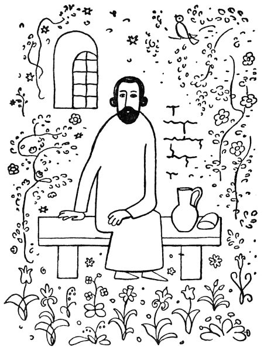

<section>

Když tedy, jak už víte, přivedl Sidney Hall kouzelníka zatčeného, bylo zahájeno soudní řízení pro ukradenou kočku.

</section>

<section>

Za vysokým stolem trůnil soudce doktor Korpus, stejně tlustý, jako přísný. Na lavici obžalovaných seděl kouzelník s rukama spoutanýma.

„Vstaň, padouchu,“ zahřímal na něj doktor Korpus. „Jsi obviněn, že jsi ukradl královu kočku Jůru, rozenou zde v zemi, rok starou. Přiznáváš se, ničemo?“

„Ano,“ řekl kouzelník tiše.

„Lžeš, lotře,“ hřímal soudce, „nevěřím ti ani slovo. To se musí dokázat. Hej, přiveďte sem svědkyni, naši nejjasnější princeznu.“

Přivedli malou princeznu, aby svědčila.

„Princezničko,“ švitořil Korpus líbezně, „ukradl tady ten podlec vaši ušlechtilou kočku Jůru?“

„Ano,“ řekla princezna.

„Vidíš, lumpe,“ zahromoval soudce na kouzelníka, „jsi usvědčen! A co, pověz, jak jsi ji ukradl?“

„Inu tak,“ řekl kouzelník, „že mi spadla sama na hlavu.“

„Bídáku, lžeš,“ rozkřikl se na něj soudce a obrátil se k princezně nejtenčím hláskem: „Princezničko, jak ten zlosyn ukradl vaši nejjasnější kočku?“

„Zrovna tak,“ řekla princezna, „jak povídá.“

„Tak vidíš, ty loupežníku,“ křikl soudce na kouzelníka, „teď už víme, jak jsi ji ukradl! A proč jsi ji, darebáku, ukradl?“

„Protože si tím pádem zlomila nožičku. Vzal jsem ji pod kabát, abych jí tu nožičku napravil a zavázal.“

„I ty vyvrheli,“ spustil doktor Korpus, „všechno je lež, co říkáš! Přiveďte sem svědka, hostinského ze Strašnic.“

Přivedli tedy toho svědka.

„Hej, hospodo,“ křikl soudce, „co víš tady o tom zločinci?“

„Jen to,“ povídal hostinský bázlivě, „že přišel, slavný soude, do mého hostince, vytáhl zpod kabátu ňákou černou kočku a zavázal jí nožičku.“

„Hm,“ zabručel doktor Korpus, „snad lžeš. A co dělal s tím vznešeným zvířátkem potom?“

„Potom,“ řekl hostinský, „ji pustil a kočka běžela pryč.“

„Ha, ty trapiči zvířat,“ uhodil soudce na kouzelníka, „pustils ji, aby utekla! Kde je teď králova kočka?“

„Snad běžela,“ pravil kouzelník, „v ta místa, kde se narodila. To kočky, víme, dělávají.“

„Ha, ty hanebníku,“ burácel soudce, „ty mne chceš poučovat? Princezničko,“ obrátil se zase k princezně tenounkým hlasem, „zač si ceníte svou vysoce ctěnou kočku Jůru?“

„Za půl království bych ji nedala,“ prohlásila princezna.

„Vidíš, ničemo,“ zahřímal soudce na kouzelníka, „ukradl jsi půl království! Na to je, bídníku, trest smrti!“

Tu bylo princezně líto kouzelníka. „Snad bych,“ řekla honem, „dala Jůru za kousíček dortu.“

</section>

<section>

</section>

<section>

„A zač je, princezno, kousíček dortu?“

„Inu,“ povídá princezna, „oříškový je za pětník, jahodový za dva a smetanový za tři pěťáky.“

„A za jaký dort byste, princezničko, Jůru dala?“

„Třeba za smetanový,“ řekla princezna.

„Ha, ty vrahu,“ křičel soudce na kouzelníka, „tož jako bys tři pěťáky ukradl. Za to dostaneš, padouchu, podle zákona tři dny šatlavy! Marš do šatlavy, prašivko, na tři dny, holomku, zloději, loupežníku! Drahá princezničko,“ obrátil se zas k princezně, „mám tu čest vám poděkovati za vaše moudré a veledůmyslné svědectví. Vyřiďte, prosím, panu tatínkovi nejoddanější pozdrav jeho nejposlušnějšího, nejvěrnějšího a nejspravedlivějšího soudce doktora Korpuse.“

Když kouzelníka odvedli do šatlavy, dali mu kus plesnivého chleba a ve džbánku smrduté vody. Než kouzelník jen seděl a usmíval se a jeho oči zářily víc a více. O půlnoci se zvedl a mávl rukou. Tu zazněla sladká hudba a vzduch zavoněl jakoby tisícem květů. A skutečně, hle, na pustém žalářním dvoře rázem vyrostly houštiny kvetoucích růží, trsy lilií zvedly své kalichy k spanilému měsíci, rozkvetly záhony macešek a konvalinek, kvetoucí kalina a pivoňka houpaly těžkými květy, hloh rozvil se bíle a rudě a v jeho koruně se rozezpíval slavík.

Tu procitl ve své kobce odsouzený vrah a žhář na svém tvrdém loži si vytíral spánek z očí; trestaný rváč se udiven zvedal, zloděj vykřikl úžasem a podvodník, který tu odpykával svou vinu, sepjal ruce nechápaje, co se to stalo. Neboť chladné a vlhké stěny žalářní se rozevřely a rozklenuly v podobě štíhlého, půvabného sloupoví; nečistá lože trestanců pokryla se bělostným lnem, nebylo tu již závor a mříží, nýbrž několik kamenných schodů vedlo přímo do kvetoucí zahrady.

„Franto,“ zabručel vrah na žháře, „spíš?“

„Nespím, člověče,“ řekl žhář, „ale mám fantas; zdá se mně, že už nejsem v kriminále.“

„Hoši,“ zvolal rváč, „myslím, že jsem zrovna zemřel a dostal se do nebe!“

„Do nebe,“ vykřikl podvodník, „je nějaké nebe pro mne? Ale i já mám krásný sen, jako bych snad v ráji byl.“

„To není sen,“ povídá zloděj; „hoši, to se dá všechno hmatat; hmatám zrovna na liliový květ. Ach, kdybych si jen směl utrhnout!“

„Jen si utrhni,“ zazněl mocný a vlídný hlas, a u trestanců stál kouzelník v bílé říze. „Je pro tebe, příteli!“

„Pane,“ ptal se žhář ostýchavě, „vy jste tady jako žalářníkem?“

„Jsem trestanec jako vy, kamarádi,“ odpověděl kouzelník. „Odsouzen jako vy. Ta zahrada je pro nás. Pro nás jsou pod stromy prostřeny tabule. Pro nás zpívá slavík a kvetou růže. Pojďte večeřet!“

Všichni zasedli k bohatému stolu a počali hodovat. Kouzelník obsluhoval je vzácnými jídly a vínem. Když naléval vína podvodníkovi, sklopil tento oči a řekl tiše: „Ne, pane, mně ne!“

„Proč nechceš vína?“ tázal se kouzelník.

„Protože si ho, pane, nezasloužím. Ochudil jsem mnoho, mnoho lidí. Ach, pane, jak bych se mohl radovat z vína?“

Tu zazářily oči kouzelníkovy, ale on sám neřekl ničeho a obsluhoval ostatní. Když naléval pohár vrahovi, zachvěla se vrahova ruka a několik krůpějí rudého vína skanulo na ubrus.

„Pane,“ zvolal vrah zoufale, „proč mi to víno připomíná krev? Ach, že jsem prolil krev nevinnou! Běda mně nejbídnějšímu!“

Kouzelník neřekl ničeho, ale jeho oči zaplály ještě jasněji. Když naléval víno rváčovi, vykřikl tento: „Pane, co já mám s vínem? Ubíjel jsem lidi z bujnosti a zchromil jsem je ze svévole; uhodil jsem ruku, která mi nabízela přátelství, a týral jsem ty, kteří mne milovali nejvíce!“

Světlo rozestřelo se po tváři kouzelníkově, ale on sám neřekl ani slova, obrátil se k zloději a podával mu mísu nejkrásnějšího ovoce. „Ber si, příteli,“ řekl srdečně, „je tvoje.“

„Pane,“ zvolal zloděj, „bral jsem, co mi nenáleželo; dovolte, abych si nevzal, co mi snad náleží!“

Kouzelník se jasně usmál a přistoupil ke žhářovi: „Vezmi si ty, prosím tě,“ řekl mu, „osvěží tě to.“

„Pane můj,“ bránil se žhář, „zapálil jsem krov nad hlavou těm, kteří mi prokázali dobrodiní; jsou teď žebráky a prosí o skývu chleba. Ach, kdybych mohl raději osvěžit ty, kterým jsem ublížil!“

Tu rozzářily se oči kouzelníkovy jako hvězdy a on sám se vysoko vztyčil a řekl: „Hoši, po léta jste hladověli a žíznili; po léta jste nepocítili sladkosti na jazyku a radosti v srdci. Proč byste neměli teď jísti a píti, hodovati a užívati radosti? Vezměte si ze všeho, je to vaše!“

Ale v té chvíli bylo slyšeti v zahradě jakoby šum mnoha kroků a k hodujícím blížil se zástup chudáků, chromců a žebráků.

„Můj bože,“ vykřikl podvodník, „tady jsou ti, které jsem ochudil!“

„A já,“ zvolal vrah polo zděšen a polo radostně, „vidím tu toho, koho jsem zavraždil!“

„Probůh,“ ozval se rváč, „ti chromí a poranění jsou, pane, ti, kterým jsem ublížil!“

„A tady jste, vy všichni,“ zvolal zloděj u vytržení, „které jsem kdy obral!“

„Běda,“ vykřikl žhář, „tady těm žebrákům jsem, pane, kdysi spálil krov nad hlavou!“

Tu vyskočil podvodník a začal nositi jídla a vína těm, které kdysi ochudil; vrah roztrhal ubrus, poklekl k tomu, kterého byl zavraždil, obmyl jeho rány svými slzami a ovazoval je; rváč nalil vína a oleje na rány těch, kterým ublížil; zloděj sebral zlaté a stříbrné stolní náčiní a vnucoval je těm, které byl okradl; a když to viděl žhář, zaplakal a řekl: „Běda, co já dám vám, žebráčkové, které jsem připravil o všechno?“ A rázem otrhal všechny květy v zahradě a nasypal je žebrákům do náručí.

Když podvodník nasytil a napojil ty, které ochudil, když vrah zavázal rány zavražděného a rváč ošetřil poraněné, když zloděj obdařil okradené a žhář ověnčil hadry žebráků, sami nepožili ničeho, ale dovedli své hosty do paláce, uložili je k spánku na bíle prostřené lože a sami ulehli vedle nich na tvrdou zem.

Jen kouzelník zůstal v zahradě s rukama sepjatýma a očima zářícíma jako hvězdy. Sladký, pokojný spánek snesl se nad vězením.

Tu zaduněly těžké rány a do dveří šatlavy vkročil žalářník. „Vstávejte, lotři,“ rozkřikl se, „už tři dny spíte a nemůžeme vás probudit!“

Trestanci rázem procitli. I viděli, že leží na zemi vedle svých tvrdých, nečistých loží; vzdušné sloupy se zase změnily ve vlhké zdi žalářní a z pustého dvora zmizelo vše, co by se podobalo kvítku či rozkvetlému stromu; jen na podlaze leželo ještě něco lupenů růžových a liliových.

„Tři dny že jsme spali?“ divil se vrah.

„Cože,“ zvolal žhář, „byl to jenom sen?“

„Pane žalářníku,“ ptal se zloděj, „nebyl tu snad někdo krom nás?“

„Byl tu ten,“ bručel žalářník, „co ukradl královu kočku. Tři dny stál ve své cele bez hnutí a oči mu zářily jako hvězdy. Dnes ráno zmizel, když si odpykal svůj trest. Byl to nějaký čistý ptáček! Než se ztratil, přikouzlil našemu ctihodnému soudci, doktoru Korpusovi, oslí uši. Ale teď hybaj, lumpové, vstávejte!“

Tak začal zas trestancům bývalý život v šatlavě. Avšak něco se přece změnilo: smrdutá voda ve džbáně chutnala jim navždy nejsladším vínem, plesnivý chléb změnil se v jejich ústech v chuť nejlahodnější, líbezná vůně květů vanula šatlavou a v noci, když uléhali, pokrývalo se jejich lože bělostí nejčistší. Každé noci pak se rozestřel nad šatlavou spánek míru bez výčitek a utrpení.

</section>
