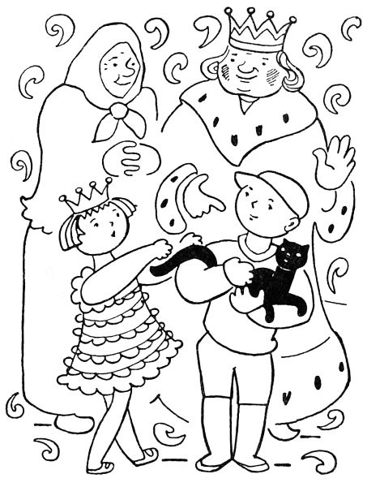

<section>

Když tedy se princezna u soudu dozvěděla, že snad její kočka Jůra utekla tam, kde se narodila, poslala hned kurýra do babiččiny chaloupky.

</section>

<section>

Letí kurýr na koni, až jiskry pod kopyty tryskají, a tu, hle, vidí před chalupou babiččina vnoučka Vaška s černou kočkou v náručí.

„Vašku,“ křičel kurýr, „princezna chce nazpátek svou kočku Jůru.“

Zabolelo srdce Vaškovo, že musí Jůru ztratit, ale řekl: „Já, pane kurýre, ji přinesu princezně sám.“

Běžel tedy Vašek do zámku s Jůrou v pytli a hned k princezně: „Tuhle, princezno,“ řekl, „nesu naši kočku. Je-li to vaše Jůra, nechte si ji.“

Otevřel Vašek pytel, ale Jůra už nevyskočila tak bujně, jako tehdy poprvé z babiččiny nůše; kulhala, chudák, na jednu nožičku.

„Já nevím,“ řekla princezna, „je-li tohle naše Jůra. Jůra ani trošku nekulhala. Ale víš co? Zavoláme Buffina.“

Když Buffino uviděl Jůru, začal radostí tak vrtět ocasem, že to svištělo; ale co jí řekl a co odpověděla Jůra, tomu nikdo z přítomných nerozuměl.

„Je to Jůra,“ zvolala princezna. „Buffino ji poznal. Ale, Vašku, co ti mám za to dát, žes ji přinesl? Chceš peníze?“

Vašek se začervenal a řekl honem: „Nechci, princezno. Babička jich má tolik, že si neví s nimi rady.“

„Nebo – nebo – chtěl bys kousek dortu?“ ptala se princezna.

„Ba ne,“ povídá Vašek, „my ti máme buchet, co chceme.“

„Nebo – nebo –,“ přemýšlela princezna, „nechtěl by sis vybrat něco tadyhle z mých hraček?“

„Kdepak,“ mávl Vašek rukou. „Já mám, koukej, takovou kudlu a vyřežu si sám, co chci.“

Princezna už opravdu nevěděla, co má Vaškovi nabídnout. „Ale, Vašku,“ povídá konečně, „řekni si sám, co chceš dostat.“

„Inu, princezno,“ řekl Vašek a začervenal se jako mák.

„Tak řekni, Vašku,“ naléhala princezna.

„To nesmím říci,“ bránil se Vašek rudý až po uši.

Teď se začervenala princezna jako pivoňka. „A proč bys,“ povídá, „to nesměl říci?“

„Protože,“ řekl nešťastný Vašek, „bys mně to stejně nedala.“

Princezna se zarděla jako růže. „A co,“ povídá rozpačitě, „dám-li ti to?“

Vašek vrtěl hlavou: „Nedáš.“

„A co když dám?“

„Nesmíš,“ povídá Vašek smutně. „Já nejsem princ.“

„Koukej, Vašku, támhle,“ řekla rychle princezna, a když se Vašek ohlédl, stoupla si na špičky a dala mu honem hubičku na tvář. Než se Vašek vzpamatoval, byla už v koutku, chytla Jůru a skrývala líčka v jejím kožiše.

Vašek planul a zářil. „Tak pánbůh vám naděl, princezno,“ řekl, „a já zase půjdu.“

„Vašku,“ zašeptala princezna, „bylo to to, cos chtěl?“

„Bylo, princezno,“ vyhrkl Vašek horlivě. Tu přišly do komnaty dvorní dámy a Vašek se hleděl honem ztratit.

Vesele klusal Vašek domů; jen natolik se zdržel v lese, co vyřezal kudlou z kůry pěknou lodičku a s lodičkou v kapse běžel domů.

</section>

<section>

</section>

<section>

Když přišel domů, – Jůra tam sedí na zápraží a myje si chromou nožičkou kožich.

„Babičko,“ spustil křik Vašek, „vždyť jsem zrovna teď donesl Jůru do zámku!“

„Inu, hochu,“ povídá babička, „to už je nátura koček, že se vracejí tam, kde se narodily, i kdyby to bylo na míle mil cesty. Běž a dones ji ráno do zámku znova.“

Ráno běžel Vašek s Jůrou znova do zámku. „Princezno,“ řekl bez dechu, „tady zas nesu Jůru. Utekla vám, slota, rovnou do naší chalupy.“

„Ty kluku,“ povídá princezna, „umíš ty utíkat jako vítr!“

„Princezno,“ repetil Vašek, „chtěla bys tuhle lodičku?“

„Dej sem,“ řekla princezna. „A co ti mám dnes dát za Jůru?“

„Nevím,“ na to Vašek a hned se začervenal až po vlasy.

„Tak pověz,“ šeptala princezna a zarděla se ještě víc.

„Nepovím.“

„Pověz!“

„Nepovím.“

Princezna sklonila hlavu a dloubala prstem do lodičky. „Chtěl bys,“ povídá konečně, „třeba zas to, co včera?“

„No třeba,“ vyhrkl Vašek spěšně; a když to dostal, běžel s veselou domů. Jen u vrbin se trochu zdržel a vyťukal pěknou zpěvnou píšťalku.

Když přišel domů, – Jůra tam sedí na zápraží a hladí si tlapkou vousiska. „Babičko,“ spustil Vašek znovu, „Jůra je zas tady!“

„I tak ji popadni,“ povídá babička, „a běž s ní zítra znova do zámku. Snad si tam pak už zvykne.“

Ráno tedy běžel Vašek zase do zámku, Jůru v pytli na zádech. „Princezno,“ spustil hnedle, „Jůra zas utekla k nám.“

Ale princezna se škaredila a neřekla nic.

„Koukej, princezno,“ repetil Vašek, „tuhle píšťalku jsem včera vyťukal.“

„Dej sem,“ řekla princezna a škaredila dál. Vašek přešlapoval a nevěděl, proč se princezna zlobí.

Princezna foukla do píšťalky, a když píšťalka pěkně zazpívala, povídá: „Ty kluku, já vím, že to děláš s tou kočkou naschvál, abych – abys – abys dostal od cesty zas to co včera.“

Vašek zesmutněl, sebral čepici a řekl: „Když si to, princezno, myslíte, tak je dobře; ale já už sem víckrát nepřijdu.“

Se smutnou a pomalu vracel se Vašek domů. Sotva přišel, – sedí vám zas Jůra na zápraží a jen se olizuje, jak se nažrala mléka. I sedl si Vašek k ní, vzal si ji na klín a mlčel.

Tu dupy dup, přihnal se na koni králův kurýr. „Vašku,“ křikl, „král ti vzkazuje, abys přinesl Jůru do zámku.“

„K čemupak to,“ řekl Vašek, „kočka se vždycky vrátí tam, kde se narodila.“

„Ale princezna, Vašku,“ káže kurýr, „princezna ti vzkazuje, abys ji přinesl třeba každý den.“

Vašek zavrtěl hlavou. „Řekl jsem jí, že už nepřijdu.“

Tu vyšla babička na zápraží a povídá: „Pane kurýre, pes se drží člověka, ale kočka se drží chalupy. Téhle chalupě už zůstane Jůra věrná.“

Kurýr otočil koně a hnal se do zámku. Druhého dne přijel před babiččinu chalupu veliký vůz, tažený stem koní. Kočí slezl a zavolal babičku. „Babičko,“ povídá, „pan král vzkazuje, že když se kočka drží chalupy, mám přivézt kočku i s chalupou a i s vámi a Vaškem. Však prý se ta chalupa do královské zahrady dobře vejde.“

Přišlo mnoho lidí a pomohli naložit celou chalupu na vůz. Kočí zapráskal bičem a křičel hyjé, sto koní zatáhlo a vůz i s chalupou se hnul k zámku. Na voze na prahu chalupy seděla babička, Vašek a Jůra. Tu si babička vzpomněla, jak králova maminka měla sen, že Jůra přivede do zámku příštího krále a že ten příští král přijede se svým celým domem. Vzpomněla si na to, ale neříkala nic.

Ten vůz s velikou radostí v zámku přivítali, složili chalupu v zahradě, a protože se Jůra držela chalupy, už jí nenapadlo utéci. Žila tam s babičkou i Vaškem jako doma. Když si s ní chtěla princezna pohrát, musela za ní do chalupy; a protože podle všeho měla Jůru tuze ráda, chodila tam denně a spřátelila se s Vaškem převelmi.

Co následovalo potom, to už do naší pohádky nepatří. Ale stal-li se Vašek opravdu králem v té zemi, když dorostl, nebylo to, děti, ani pro tu kočku, ani pro přátelství princeznino, nýbrž pro mocné a statečné skutky, které veliký Vašek pro celou zemi vykonal.

_Nůše pohádek I, 1918_

</section>
