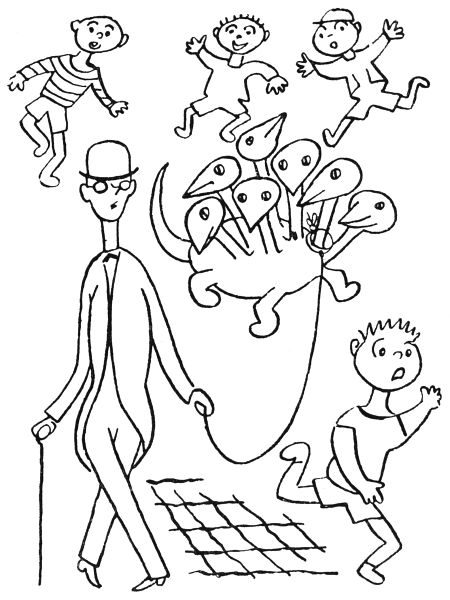

Tak to snad, děti, víte, že na každé policejní strážnici neboli štaci bdí několik pánů strážníků po celou noc, kdyby se snad něco stalo, jako třeba že by se někam dobývali loupežníci nebo kdyby zlí lidé chtěli někomu udělat škodu. Proto jsou páni strážníci na strážnici až do rána vzhůru, zatímco jiní strážníci, kterým se říká patroly, chodí po ulicích a dávají pozor na loupežníky, zlodějíčky, strašidla a jiné takové nepořádky. A když takové patrole začnou bolet nožičky, vrátí se na strážnici a zas jiný strážník jde na ulici dávat pozor. Tak to chodí po celou noc; a aby jim to líp uteklo, kouří ti strážníci na strážnici fajfky a povídají si, co kde zvláštního viděli.

  

Tak jednou tak pokuřovali a hovořili, když se vrátil z patroly jeden strážník, počkejme, však to byl pan Halaburd, a řekl: „Nazdar, mládenci! Hlásím, že mě bolí nožičky.“

„Tak si sedni,“ kázal mu nejstarší pan strážník, „a místo tebe půjde hlídat tuhle pan Holas. A teď nám, pane Halaburde, povídej, co je nového v tvém rajónu a v jakých případech jsi ve jménu zákona zakročil.“

„Dnes v noci toho mnoho nebylo,“ pravil pan Halaburd. „Ve Štěpánské ulici se praly dvě kočky; tak jsem je jménem zákona rozehnal a napomenul. Potom v Žitné ulici vypadl z hnízda mladý vrabec, bytem v čísle 23. Zavolal jsem staroměstské hasiče, aby přijeli se žebříkem a dopravili řečeného vrabce do jeho hnízda. Jeho rodiče byli napomenuti, aby dávali lépe pozor. A když jsem šel dolů Ječnou ulicí, zatahalo mě něco za nohavici. Koukám, a on je to skřítek. Víte, ten fousatý z Karlova náměstí.“

„Který?“ ptal se nejstarší pan strážník. „Tam jich bydlí několik: Mydlifousek, Kolbaba řečený Dědek, Šmidrkal, Padrholec, Pumprdlík, Kváček zvaný Fajfka, Kuřinožka a Tintěra, ten, co se tam přestěhoval od Apolináře.“

„Ten, co mě tahal za kalhoty,“ řekl pan Halaburd, „byl Padrholec, co bydlí v té staré vrbě.“

„Aha,“ děl nejstarší pan strážník. „Mládenci, to je jeden moc hodný rarášek, ten Padrholec. Když někdo na Karlově náměstí něco ztratí, třeba prsten, míč, merunu nebo pumlíč, tak ten Padrholec to vždycky donese hlídači jako poctivý nálezce. Tak dál.“

„A ten skřítek, ten Padrholec,“ pokračoval strážník Halaburd, „mně povídá: ‚Pane strážníku, já nemůžu domů, mně vlezla do mého bytu na vrbě veverka a nechce mě tam pustit.‘ – Tak jsem vytasil šavli, šel jsem s Padrholcem k jeho vrbě a vyzval jsem ve jménu zákona veverku, aby opustila příbytek a nedopouštěla se takových zločinů, přečinů a přestupků, jako je rušení držby, rušení veřejného pořádku, násilí a zlodějovina. Načež ta veverka řekla: ‚Až naprší.‘ Tu jsem svlékl opasek a plášť a vylezl na tu vrbu. Když jsem byl u té díry po vypadlém suku, co v ní má pan Padrholec byt, začala ta veverka plakat: ‚Pane strážníku, prosím vás, nezatýkejte mě! Já jsem se tady u pana Padrholce jenom schovala, protože pršelo a do mého kvartýru teče.‘ – ‚Žádné řeči, paničko,‘ já na to, ‚seberte svých pět švestek nebo bukvic a pakujte se ze soukromého příbytku pana Padrholce. A kdyby se ještě jednou opakovalo, že byste násilím nebo oukladně, bez jeho svolení a souhlasu vnikla do jeho privátu, tak zavolám posily, obklíčíme vás, zatkneme vás a dopravíme vás spoutanou na policejní komisařství. Tak hybaj!‘ – A to je, lidičky, všechno, co jsem téhle noci viděl.“

„Já jsem jakživ žádného skřítka nezahlíd,“ ozval se strážník Bambas. „Já jsem měl dosud rajón v Dejvicích a tam v těch nových domečkách žádné takové zjevy, bytosti, nebo jak se tomu říká, nadpřirozené úkazy nejsou.“

„Tady jich je hromada,“ řekl nejstarší pan strážník. „A dřív jich bejvalo, kdepak! Příkladně u Šítkovského jezu se vyskytoval vodník, co svět světem stojí. S ním neměla policie jakživa co dělat, takový to byl řádný vodník. Libeňský vodník je starý filuta, ale Šítkovský, to byl moc správný člověk. Však ho vodárenský ouřad města Prahy jmenoval vrchním městským vodníkem a platil mu měsíční gáži. Ten Šítkovský vodník hlídal Vltavu, aby nevyschla; povodně on nedělal, ty dělají venkovští vodníci z horní Vltavy, například Vyderský, Krumlovský a Zvíkovský. Ale ten Libeňský vodník ho ze závisti poštval, aby žádal od města Prahy za své služby titul a plat magistrátního rady; a když mu na radnici řekli, to že jako nejde, protože prý nemá příslušné vysokoškolské vzdělání, urazil se ten Šítkovský vodník a odstěhoval se z Prahy. Teď prý dělá vodu v Drážďanech. To se ví, všichni labští vodníci v Němcích až po Hamburk jsou Češi jako polena. A od té doby není u Šítkovského jezu žádný vodník. Proto ono bývá v Praze málo vody. Potom na Karlově náměstí tancovala v noci světýlka. Ale protože to nedělalo dobrotu a lidi se jich báli, uzavřela s nimi pražská obec dohodu, že se přestěhují do Stromovky a tam že je bude rozžíhat a k ránu zhášet zřízenec od plynárny. Jenže ten zřízenec, který je rozžíhal, musel za války narukovat a tak se na ta světýlka zapomnělo. – Co se týče rusalek, těch bejvalo jenom ve Stromovce sedmnáct; ale z nich asi tři šly k baletu, jedna se dala k filmu a jedna se provdala za nějakého železničáře ze Střešovic. Tři rusalky jsou v Kinského zahradě, dvě působí v Grébovce a jedna se zdržuje v Jelením příkopu. Městský zahradník z Riegrových sadů si chtěl jednu rusalku nasadit do svého parku, ale nějak se mu tam nedržela; myslím, že tam na ni bylo příliš větrno. – Potom policejně zapsaných skřítků, kteří jsou příslušni do veřejných budov, parků, klášterů a knihoven, je v Praze tři sta čtyřicet šest, nepočítajíc rarášky v soukromých domech, které nemáme v evidenci. – Strašidel v Praze bejvalo habaděj, ale teď jsou zrušena, protože bylo vědecky dokázáno, že žádná strašidla nejsou. Jen na Malé Straně prý lidé tajně a nezákonně přechovávají na půdách pár starožitných strašidel, jak mně tuhle říkal kolega z malostranského komisařství. A to je, pokud vím, všechno.“

„Krom toho draka neboli saně,“ řekl strážník Kubát, „co zabili na Žižkově v Židovských pecích.“

„Žižkov,“ děl nejstarší strážník, „to nebyl nikdy můj rajón, tak o tom draku mnoho nevím.“

„Já byl při tom,“ řekl strážník Kubát, „ale celý případ měl v práci a v referátě kolega Vokoun. Ono to už je hodně dávno, ještě když byl naším policejním prezidentem pan Bienert. Tak jednou večer povídala tomu Vokounovi jedna stará paní, byla to paní Částková, trafikantka, ale ona je vlastně bába vědma čili prorokyně a sudička, abyste věděli, tedy ta paní Částková řekla kolegovi Vokounovi, že jí vyšlo v kartách, že v Židovských pecích drží drak Huldabord v zajetí překrásnou pannu, kterou unesl jejím rodičům; a ta panna prý je princezna murciánská. ‚Murciánská nebo nemurciánská,‘ řekl na to strážník Vokoun, ‚tu holku musí drak vydat rodičům, nebo proti němu zakročím podle předpisů, zvaných služební řád, foršrifty čili instrukce.‘ To řekl, opásal se služební šavlí a šel do Židovských pecí. Já myslím, že by to tak udělal každý z nás.“

„To si myslím,“ děl strážník Bambas. „Ale já jsem v Dejvicích a Střešovicích žádného draka neměl. Tak dál.“

„Tedy kolega Vokoun,“ pokračoval strážník Kubát, „se opásal boční zbraní a šel hned v noci do Židovských pecí. A namouduši, z jedné té díry čili sluje slyší halasit hrubé hlasy. I posvítil si tam služební baterkou a zmerčil strašlivého draka se sedmi hlavami; a ty hlavy spolu hovořily, odpovídaly si a někdy se i pohádaly a nadávaly si – to víte, takový drak nemá žádné manýry, a když, tak jen špatné. A v koutě té jeskyně doopravdy plakala překrásná panna a zacpávala si uši, aby neslyšela, jak ty dračí hlavy spolu tlustým hlasem mluví.

‚Hej vy jeden,‘ zvolal kolega Vokoun na toho draka zdvořile sice, ale se služební přísností, ‚legitimujte se; máte nějaké papíry, domovský list, služební knížku, zbrojní pas nebo jiné osobní doklady?‘

Tu se jedna z těch dračích hlav zachechtala, jedna se rouhala, jedna klela, jedna láteřila, jedna spílala, jedna nadávala a jedna vyplazovala na Vokouna jazyk. Ale kolega Vokoun se nedal a zvolal: ‚Ve jménu zákona, seberte se a pojďte se mnou šupity na komisariát, vy i ta holka tam vzadu.‘

‚To zas pr,‘ rozkřikla se jedna z těch dračích hlav. ‚Víš-li, ty lidská pápěrko, kdo já jsem? Já jsem drak Huldabord.‘

‚Huldabord z hor Granadských,‘ řekla druhá hlava.

‚Řečený též Velká Saň Mulhacenská,‘ křikla třetí hlava.

‚A já tě slupnu,‘ zařvala čtvrtá, ‚jako malinu.‘

‚Roztrhám tě na cucky, na mandžáry, na padrť, na cimprcampr a krom toho tě roztrhnu vejpůl jako slanečka, až se budou z tebe piliny sypat,‘ zahřímala pátá hlava.

‚A pak ti zakroutím krk,‘ zaburácela šestá.

‚A bude po ptákách,‘ dodala sedmá hlava strašným hlasem.

Co myslíte, mládenci, že nyčko udělal kolega Vokoun? Řekli byste, že se lekl? Kdepak! Když viděl, že to po dobrém nejde, vzal služební obušek čili pendrek a natřel jím jednu dračí kotrbu po druhé, co měl síly; a sílu on má humpoláckou.

‚A heleme,‘ řekla první hlava, ‚tohle není špatné.‘

‚Právě mě svrbělo temeno,‘ pravila druhá.

‚A mne kousala v týle nějaká muňka,‘ děla třetí.

‚Drahoušku,‘ řekla čtvrtá, ‚polechtej mě ještě tou hůlkou!‘

‚Ale klepni silněji,‘ radila pátá, ‚aby to trochu luplo.‘

‚A víc vlevo,‘ žádala šestá, ‚tam mě to strašně svědí.‘

‚Na mne je ten tvůj proutek moc měkký,‘ mínila sedmá. ‚Nemáš něco tvrdšího?‘

Tu vytasil strážník Vokoun šavli a sedmkrát ťal, do každé hlavy jednou, až na nich šupiny zařinčely.

‚Tohle už bylo trochu lepší,‘ řekla první hlava drakova.

‚Aspoň jsi usekl ucho jedné bleše,‘ libovala si druhá hlava; ‚já mám totiž ocelové breberky.‘

‚A mně jsi vyťal ten vlas, co mě zrovna svědil,‘ pravila třetí.

‚A mně jsi pročísl mikádíčko,‘ pochvalovala si čtvrtá hlava.

‚Tím tvým hřebínkem bys mě mohl podrbat denně,‘ broukala pátá.

‚Vždyť já jsem to pírko ani necítila,‘ povídala šestá.

‚Člověče zlatá,‘ řekla sedmá hlava, ‚pošimrej mě ještě jednou!‘

Tu vytáhl strážník Vokoun služební revolver a sedmkrát střelil, do každé dračí hlavy jednou.

‚Kruciturci,‘ vyhrkla saň, ‚neházej na mě tím pískem, vždyť toho budu mít plné vlasy! Safra, mně ten tvůj drobeček vlítl do oka! A tuhle mně to tvé smítko uvázlo mezi zoubky! Tak, a teď už toho mám právě dost,‘ zařval drak, odkašlal všemi sedmi hrdly a ze všech sedmi tlam soptil oheň proti kolegovi Vokounovi.

Kolega Vokoun se nelekl; vytáhl služební předpisy a přečetl si, co má strážník dělat, když má proti sobě přesilu; našel, že v takovém pádě má zavolat posilu. Potom si vyhledal předpis, co má dělat, když někde šlehá oheň, a našel, že za těch okolností má telefonovat pro hasiče. Tak si přečetl všechno, co má dělat, a zavolal hasiče a policejní posilu. Na tu posilu nás přiběhlo poklusem šest, kolegové Rabas, Holas, Matas, Kudlas, Firbas a já, a kolega Vokoun nám řekl: ‚Mládenci, tak tuhle máme vysvobodit tu holku z moci toho draka. On je sic drak pancéřový a na toho je každá šavle slabá, ale já jsem vypozoroval, že v zátylku je ten drak trochu měkčí, aby se mohl ohýbat. Tak až řeknu tři, musíte ho všichni seknout šavlí do zátylku. Ale dřív musí hasiči toho draka uhasit, aby nám nepropálil mundúr.‘ Jen to dořekl, když tu trárá přijelo k Židovským pecím sedm motorových stříkaček se sedmi hasiči. ‚Hasiči, pozor,‘ zvolal udatně strážník Vokoun, ‚až řeknu tři, začne každý z vás stříkat na jednu dračí palici, ale to musíte rovnou do chřtánu, co má drak mandle, protože tamtudýma jde ten oheň ven. Tak pozor: raz, dva, tři!‘ A jak řekl tři, pustili hasiči sedm proudů vody rovnou do sedmi dračích tlam, co z nich šlehal oheň jako z autogenu. Šššš, to vám to syčelo! Drak prskal, frkal a funěl, kašlal, kuckal a klel, chroptěl, chrčel, chrchlal a chrochtal, supěl, soptil, syčel a sípal a volal maminko a mlátil kolem sebe ocasem, ale hasiči nepopustili a stříkali a stříkali, až se z těch sedmi dračích hlav místo šlehajícího ohně vyvalila pára jako z lokomotivy, že nebylo na krok vidět. Potom ta pára prořídla, hasiči přestali stříkat, zatroubili a jeli domů; a drak, celý zmáčený a schlíplý, jen prskal a odplivoval a vytíral si vodu z očí a bručel: ‚Počkejte, kluci, tohle vám neslevím!‘ Ale tu zvolal kolega Vokoun: ‚Pozor, mládenci: ráz, dva, tři!‘ A jak řekl tři, my všichni strážníci jsme majzli šavlemi do sedmi dračích zátylků a sedm hlav se válelo na zemi; a ze sedmi krků vytryskla voda a stříkala jako z hydrantu, co jí do toho draka nateklo. ‚Tak pote, slečno,‘ řekl kolega Vokoun k té princezně murciánské, ‚ale dejte pozor, ať vám to nepocáká šatičky.‘

‚Děkuji ti, šlechetný hrdino,‘ řekla ta slečna, ‚že jsi mě vysvobodil z moci té saně. Já jsem si zrovna hrála se svými kamarádkami v murciánském parku volejbal a házenou a diabolo a na schovávanou, když tu přiletěl ten tlustý starý drak a unesl mě bez zastávky až sem.‘

‚A kudy jste to, slečno, letěli?‘ ptal se kolega Vokoun.

‚Přes Alžír a Maltu a Cařihrad a Bělehrad a Vídeň a Znojmo a Čáslav a Záběhlice a Strašnice až sem, za dvaatřicet hodin, sedmnáct minut a pět vteřin nonstop a netto,‘ řekla princezna murciánská.

‚Tak to ten drak udělal rekord v letu s cestujícími na dálku,‘ podivil se kolega Vokoun. ‚To vám, slečno, gratuluju. Ale teď abych zatelegrafoval vašemu panu otci, aby si pro vás někoho poslal.‘

Jen to dořekl, když tu zahrčelo auto a z něho vyskočil král murciánský s korunou na hlavě a celý v hermelínu a brokátu a začal radostí skákat na jedné noze a křičet: ‚Holka zlatá, tak tě konečně nalézám!‘

‚Počkat, vašnosti,‘ zarazil ho kolega Vokoun. ‚Vy jste s tím vaším autem jel po ulici zakázanou rychlostí, rozumíte? Zaplatíte sedm kaček pokuty.‘

Král murciánský se začal hrabat po kapsách a bručel: ‚To jsem blázen, vždyť jsem s sebou vzal sedm set dublonů, piastrů a dukátů, tisíc peset, tři tisíce šest set franků, tři sta dolarů, osm set dvacet marek a tisíc dvě stě šestnáct československých korun devadesát pět halířů, a teď nemám v kapse ani findy ani šupu ani grešle ani vindry. Nejspíš jsem to všechno cestou utratil za benzín a za pokuty pro nedovolenou rychlost. Statečný rytíři, já těch sedm kaček pošlu po svém vezírovi.‘ Načež murciánský král odkašlal, položil ruku na prsa a pokračoval ke kolegovi Vokounovi: ‚Vidím na tvé uniformě, jakož i na tvém vznešeném zjevu, že jsi nějaký mocný bojovník, princ, nebo dokonce státní úředník. Za to, že jsi vysvobodil mou dceru a skolil strašnou saň mulhacenskou, bych ti měl nabídnout ruku své dcery, ale ty máš na levé ruce snubní prsten, z čehož soudím, že už jsi ženatý. Máš dětičky?‘

‚Mám,‘ řekl Vokoun. ‚Mám tříletého kluka a holku v peřince.‘

‚Gratuluju,‘ pravil murciánský král. ‚Já mám jen tuhletu holku. Tak počkej, já ti dám aspoň polovičku svého murciánského království. To dělá okrouhle sedmdesát tisíc čtyři sta padesát devět čtverečních kilometrů plošné výměry se sedmi tisíci a sto pěti kilometry železnic, dvanácti tisíci kilometry silnic a dvaceti dvěma milióny sedmi sty padesáti tisíci devíti sty jedenácti obyvateli obého pohlaví. Tak co, plácnem si?‘

‚Pane králi,‘ řekl na to kolega Vokoun, ‚ono to má své potíže. Já a tuhle kamarádi jsme toho draka zabili ze služební povinnosti, protože neposlechl mé úřední výzvy a nechtěl jít se mnou na komisařství. A za služební výkon nikdo z nás nesmí přijmout žádnou odměnu, kdepak! Panečku, to my máme zakázáno.‘

‚Aha,‘ pravil král. ‚Ale snad bych mohl tu polovičku murciánského království s veškerým zařízením věnovat na znamení své královské vděčnosti celé pražské policii.‘

‚To už by šlo spíš,‘ mínil kolega Vokoun, ‚ale ono to má, pane králi, své potíže. My máme celý pražský obvod až po potravní čáru, a co už nám jen ta Praha dá chodění a hlídání! Kdybychom měli ještě polovičku království murciánského a museli ji hlídat, tak bychom se moc naběhali a bolely by nás nožičky. Pane králi, my vám mockrát děkujeme, ale nám stačí Praha.‘

‚Tak aspoň,‘ řekl král murciánský, ‚vám dám, hoši, tady ten páček tabáku, co jsem si vzal na cestu. Je to pravý murciánský a stačí zrovna do sedmi fajfek, když si je nenacpete plné. Tak, dceruško, šup do vozu a jedem.‘ – A když byl v prachu – a prachu nadělal ten král náramného –, my, totiž kolegové Rabas, Holas, Matas, Kudlas, Firbas a Vokoun a já, jsme šli na strážnici a nacpali jsme si fajfky tím murciánským tabákem. Mládenci, takový tabák jsem jakživ nekouřil; nebyl ani tak moc silný, ale voněl jako med, jako vanilka, jako čaj, jako skořice, jako kadidlo, jako karafiát a jako banány, ale protože nám tuze smrděly fajfky, tak jsme tu vůni ani necítili. A ten drak měl přijít do muzea, ale nežli si pro něho přijeli, změnil se v rosol, protože moc navlhnul a nasákl tou vodou a zkazil se. A to je všechno, co vím.“

Když strážník Kubát na strážnici dopovídal pohádku o draku na Židovských pecích, všichni strážníci po nějaký čas mlčky pokuřovali; to asi mysleli na ten murciánský tabák. Potom se ozval strážník Choděra: „Když tadyhle kolega Kubát povídal o žižkovském drakovi, tak já vám třeba povím o té sani z Vojtěšské ulice. Jednou jsem měl pochůzku po Vojtěšské ulici a najednou vám vidím v tom koutě u kostela velikánské vejce. Ono bylo tak veliké, že by se mně nevešlo ani do služební přílby, a těžké vám bylo jako z mramoru. Propánakrále, řekl jsem si, to snad je pštrosí vejce nebo co, já to odnesu na policejní direkci, na oddělení ztrát a nálezů; snad se o takové vejce jeho majitel přihlásí. – Tehdy byl v tom oddělení kolega Pour a měl zrovna od záchladu v kříži loupání; tak si topil v železných kamínkách, že tam bylo horko jako v troubě, jako v peci, jako v sušárně. ‚Těbůh, Poure,‘ povídám, ‚ty tu máš teplo jako čertova babička. Tadyhle hlásím, že jsem našel ve Vojtěšské ulici nějaké vejce.‘ ‚Tak to někam polož,‘ řekl kolega Pour, ‚a sedni si; a já ti budu hlásit, jaké mám trápení s tím loupáním v kříži.‘ Nu, trochu jsme se zapovídali, jak už tak řeč plyne; pak se začalo smrákat a najednou slyšíme v koutě něco jako křupat nebo harašit. Tak jsme rozsvítili a koukáme, a ona vám z toho vejce vylízá saň – nejspíš se vylíhla tím náramným teplem. Ona nebyla větší, než řekněme pudl nebo foxteriér, ale byla to saň, to jsme poznali hned, protože měla sedm hlav; podle toho se totiž pozná drak.

‚Kryndapána,‘ řekl kolega Pour, ‚co s tím tady budeme dělat? To abych zatelefonoval pro antouška, aby to zvíře odklidil?‘

‚Víš, Poure,‘ povídám mu já, ‚taková saň je dost vzácné zvíře; já myslím, že bychom měli dát do novin inzerát, aby se její majitel přihlásil.‘

‚No dobrá,‘ řekl Pour, ‚ale čím ji zatím budeme krmit? Zkusím to s mlíkem a nadrobenou houstičkou; každému mláděti je mlíčko nejzdravější.‘

Tak jí nadrobil sedm žemlí do sedmi litrů mléka; a to jste měli vidět, jak se to dráče do toho hladově pustilo; jedna hlava odstrkovala u misky druhou a všecky ty hlavy na sebe vrčely a chlemtaly mlíčko, až pobryndaly celou kancelář; potom se jedna hlava po druhé olízla a uložila se k spánku. Pak kolega Pour zamkl tu saň ve své kanceláři, kde byly uloženy všechny ztracené a nalezené věci z celé Prahy, a dal do všech novin tenhle inzerát:

> _Štěně dračí_,

> čerstvě vylíhlé z vejce, bylo nalezeno ve Vojtěšské ulici. Totéž je sedmihlavé, žluté a černě žíhané. Jeho majitel ať se přihlásí na policejním ředitelství, oddělení ztrát a nálezů.

Když ráno kolega Pour přišel do své kanceláře, neřekl nic víc nežli: ‚Safra zatrápeně zatrachtile propánakrále kristovanoho panenanebi saknaryby rányboží uvšechvšudy učerchmana ustahromů propětran kakraholte a namouduchu, abych neklel!‘ Ona vám ta saň přes noc sežrala všechny věci, které kdo v Praze ztratil nebo našel, tedy prsteny a hodinky, peněženky, taštičky a notesy, míče a tužky, penály a držátka a školní knihy a kuličky k hraní a knoflíky a rysovadla a rukavice a ještě k tomu všechna úřední lejstra, akta, protokoly a listiny, zkrátka všechno, co v Pourově kanceláři bylo, dokonce i Pourovu fajfku, lopatku na uhlí a pravítko, kterým Pour linýroval lejstra; ta saň toho snědla tolik, že byla už jednou tak velká a některým jejím hlavám bylo špatně.

‚Teda tohle nepůjde,‘ povídal kolega Pour, ‚já si to zvíře tady nechat nemůžu.‘ A zatelefonoval Spolku pro ochranu zvířat, aby svrchupsaný vážený Spolek tomu dračímu mláděti poskytl útulek, jako to dělává pro zaběhlé pejsky a kočičky. ‚Pročpak ne,‘ řekl Spolek a vzal to dráče do svého útulku. ‚Ale to bych rád věděl,‘ řekl potom ten Spolek, ‚čím se vlastně taková saň živí. V přírodopise o tom nic není.‘ Tak to zkusili a krmili toho draka mlíčkem, párky, salámem, vajíčky, mrkví, kašičkou, čokoládou, husí krví, hrachem, senem, polívkou, zrním, extravuřtem, rajčaty, rýží, houskami, cukrem, bramborem a křížalami; to dráče to sluplo všechno a ještě jim sežralo knihy, noviny, obrazy, kliky na dveřích a vůbec všechno, co tam měli; a rostlo tak, že už bylo větší než bernardýn.

Ale zatím došel na ten Spolek telegram až z Bukurešti, ve kterém bylo psáno černokněžnickým písmem:

> TO DRAČÍ ŠTĚNĚ JE ZAKLETÝ ČLOVĚK. BLIŽŠÍ ÚSTNĚ. PŘIJEDU BĚHEM TŘÍ SET LET NA WILSONOVO NÁDRAŽÍ. KOUZELNÍK BOSKO.

Tu se ten Spolek pro ochranu zvířat podrbal za ušima a řekl: ‚Ouha, když ta saň je zakletý člověk, tedy je to lidská osoba, a my ji nemůžeme chovat v ochraně zvířat. To ji musíme poslat do nalezince nebo do sirotčince.‘ Ale ty nalezince a sirotčince zase řekly: ‚Ouha, když je ten člověk zaklet do zvířete, tak už to není člověk, ale zvíře, protože je zaklet do zvířete. Ergo zakletý člověk nepatří do referátu nám, ale ochraně zvířat.‘ A protože se nemohli dohodnout o tom, je-li člověk zakletý do zvířete víc člověk, nebo víc zvíře, nechtěli tu saň chovat ti jedni, ani ti druzí a chudák saň nevěděla, čí vlastně je; to ji tak mrzelo, že přestala žrát, hlavně její třetí, pátá a sedmá hlava. On byl v tom Spolku jeden malý a tenký človíček, nepatrný a skromný jako prázdný lusk, jmenoval se nějak od N: Nováček nebo Nerad nebo Nohejl – nebo ne, pan Trutina se jmenoval; a když ten pan Trutina viděl, jak té sani zármutkem vadne jedna hlava po druhé, řekl tomu Spolku: ‚Pánové, ať už je to člověk, nebo zvíře, já bych si tu saň vzal domů a staral bych se o ni jaksepatří.‘ Tu všichni řekli: ‚No tak sláva,‘ a pan Trutina si tu saň odvedl k sobě domů.

To teda se musí říct, staral se o ni, jak náleží: krmil ji a česal ji a hladil ji – on ten pan Trutina měl moc rád zvířata; a každý večer, když přišel z práce domů, ji vyváděl na procházku, aby se trochu vyběhala; a ona skákala za ním jako pejsek a vrtěla ocasem a slyšela na jméno Amina. Jednou večer je potkal pan pohodný a povídá: ‚Halt, pane Trutina, co to mají za zvíře? Je-li to nějaký dravec nebo šelma čili zvíře divoké, tak je nesmíte vodit po ulicích; ale je-li to pejsek, tak mu musíte koupit psí známku a pověsit mu ji na krk.‘ ‚To je takový vzácný druh pejska,‘ řekl pan Trutina, ‚takzvaný pinč drakatý neboli chrt saňový čili pes sedmihlavý, viď, Amino? Bez starosti, pane drnomistr, já jí tu psí známku koupím.‘ A koupil jí psí známku, třebaže chudák musil za ni dát poslední kačku, co měl. A zas je potkal pan pohodný a řekl: ‚Pane Trutina, takhle to nepůjde; když ten váš pejsek má sedm hlav, musí mít psí známku na každém krku, protože je předpis, že každý pes má mít na krku psí známku.‘ ‚Ale, pane drnomistr,‘ bránil se pan Trutina, ‚vždyť Amina má na prostředním krku psí známku!‘ ‚To je jedna,‘ řekl pan pohodný, ‚ale ostatních šest hlav běhá beze známky na krku a to já nemůžu trpět. Já vám to vaše psisko musím zabavit.‘ ‚Prosím vás, pane drnomistr,‘ řekl pan Trutina, ‚počkejte s tím ještě tři dny, já Amině ty známky koupím.‘ A šel domů celý nešťastný, protože už neměl na penězích ani šesták.

Doma si sedl a div neplakal, jak mu toho bylo líto; říkal si, že mu jeho Aminu sebere pan pohodný a prodá ji do cirkusu nebo ji zabije. A když se tak trápil a vzdychal, připlížila se k němu ta saň a položila mu všech sedm hlav do klína a dívala se mu do očí takovýma krásnýma smutnýma očima; takové pěkné a zrovna lidské oči má každé zvíře, když se na člověka dívá s láskou a důvěrou. ‚Já tě, Amino, nedám,‘ řekl pan Trutina a poplácal tu saň na všech sedmi hlavách; a pak vzal své hodinky po tatínkovi a sváteční šaty a své nejlepší boty a všechno to prodal a ještě si nějaké peníze vypůjčil a za ty všechny peníze koupil šest psích známek a pověsil je své sani na obojky. A když pak s ní vyšel na ulici, tak ty všechny známky cinkaly a zvonily, jako když jedou saně s rolničkami.

Ale ještě toho večera přišel k panu Trutinovi jeho pan domácí a povídá: ‚Pane Trutina, mně se ten váš pes nechce líbit. Já se sic ve psech moc nevyznám, ale lidi říkají, že je to drak; a to já ve svém domě nemůžu trpět.‘ ‚Pane domácí,‘ řekl pan Trutina, ‚vždyť Amina nikomu neublížila!‘ ‚To mně je pět,‘ povídal pan domácí, ‚ale do solidního domu drak nepatří, a basta fidli. Když toho psa nechcete dát pryč, tak vám dávám od prvního výpověď z bytu. Služebník, pane Trutina.‘ A bouchl za sebou dveřmi.

‚Tak vidíš, Amino,‘ zaplakal pan Trutina, ‚teď se ke všemu musíme odtud stěhovat; ale já tě nedám.‘ Tu se k němu tichoučce přišourala ta saň a oči jí tak překrásně zářily, že to pan Trutina ani vydržet nemohl. ‚Nono,‘ řekl, ‚to víš, stará, že tě mám rád.‘

Den nato šel pln starostí do své práce – on byl totiž v nějaké bance písařem; a tam si ho zavolal jeho šéf. ‚Pane Trutina,‘ řekl ten pan šéf, ‚mně sic nic není do vašich soukromých věcí, ale tuhle jsou takové divné řeči, že prý si doma pěstujete draka. Koukejte se, žádný z našich představených nepěstuje draka. Draka si může dovolit jenom nějaký král nebo sultán, ale pro obyčejné lidi to není. Pane Trutino, vy žijete moc nad své poměry. Buď toho draka dáte pryč, nebo vám dávám od prvního výpověď.‘ ‚Pane šéf,‘ řekl Trutina tiše, ale pevně, ‚já Aminu nedám.‘ A šel domů tak zarmoucen, že se to ani povídat nedá.

Doma si sedl jako tělo bez ducha a z očí mu počaly téci slzy. ‚Teď je se mnou konec,‘ řekl si a plakal. A tu cítil, jak mu ta saň položila jednu hlavu na kolena; neviděl na ni pro slzy, ale hladil ji a šeptal: ‚Neboj se, Amino, já tě nedám.‘ A jak ji tak hladí, začalo se mu zdát, že je ta hlava nějaká měkká a kudrnatá; i vytřel si oči a podíval se – a ona místo saně klečí před ním krásná panna, opírá se mu bradou o kolena a dívá se mu sladce do očí. ‚Propána,‘ vykřikl pan Trutina, ‚kde je Amina?‘ ‚Já jsem princezna Amina,‘ řekla ta panna, ‚až do této chvíle zakletá do saně, protože jsem bývala taková pyšná a zlostná. Ale teď už, pane Trutina, budu hodná jako ovečka.‘

‚Amen,‘ ozvalo se ve dveřích a on tam stál kouzelník Bosko. ‚Vy jste ji vysvobodil, pane Trutina. Každá láska vysvobozuje lidi i zvířata z jejich zakletí. Jemináčku, děti, to to dobře dopadlo! Pane Trutina, vzkazuje vám tatínek tady té slečny, že máte jet do jeho království nastoupit na trůn. Tak alou, ať nezmeškáme vlak.‘

A to je konec toho případu se saní z Vojtěšské ulice,“ doložil strážník Choděra. „Kdybyste tomu nechtěli věřit, zeptejte se kolegy Poura.“

_Lidové noviny 14. 9. 1930_
