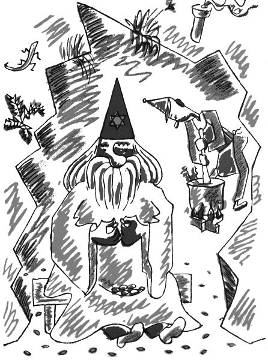

To už je tuze dávno, co vedl na hoře Hejšovině kouzelnickou živnost kouzelník Magiáš. Jak víte, bývají kouzelníci dobří, kterým se říká čarodějové neboli divotvorci, a kouzelníci zlí, kterým se říká černokněžníci. Magiáš byl takový prostřední; někdy byl tak hodný, že vůbec nečaroval, a jindy čaroval tak mocně, až hřmělo a blýskalo; někdy ho napadlo, aby pršelo kamení, a jednou dokonce udělal, že napršely takové malé žabičky. Zkrátka říkejte si, co chcete, takový kouzelník není žádné příjemné sousedství, a i když se lidé dušovali, že na kouzelníky nevěří, přece se Hejšovině raději vyhýbali; to se jen tak vymlouvali, když říkali, že to je moc do kopečka, – bodejť by se přiznali, že mají strach z Magiáše!

  

Tak ten Magiáš jednou seděl před svou slují a jedl švestky, takové ty velké modročerné a krásně ojíněné slívy, zatímco v jeskyni jeho pomocník, pihovatý Vincek, pravým jménem Vincenc Nyklíček ze Zlička, míchal nad ohněm kouzelnické lektvary ze smůly, síry, baldriánu, mandragory, hadího kořene, zeměžluče, babíhněvu a čertova koření, z kolomazi a pekelného kamínku a z trenděmendě a šalvosru a kozích bobků, z vosích žihadel, krysích fousů, muřích nožiček a zanzibarského semínka, tož z takových těch čarodějských koření, přísad, dryáků a černobejlí. A Magiáš se jen koukal, jak to pihovatý Vincek míchá, a jedl švestky. Ale chudák Vincek zapomněl míchat či co, zkrátka ty lektvary se mu v kotli přismahly, připálily, připekly, přiškvařily nebo nějak přičmoudly a vyvalil se z nich hrozný smrad.

„Ty nešiko nemotorná,“ chtěl se na něho rozkřiknout Magiáš, ale v tom spěchu si snad spletl tu pravou trubičku v krku nebo si to spletla ta švestka, co měl v ústech, zkrátka spolkl švestku i s peckou a ta pecka mu zaskočila a vzpříčila se mu v krku a nemohla ani dovnitř, ani ven; a tak měl Magiáš pokdy zařvat jenom „Ty ne –“ a dál už to nešlo, nemohl ze sebe vydat ani hlásku. Jen tak chrčel a sípěl, jako když syčí pára v hrnku, a rudl v obličeji a mával rukama a kuckal, ale pecka se ne a ne hnout; tak pevně a důkladně se mu zapříčila v hrtanu.

Když to Vincek viděl, hrozně se polekal, že se snad pantáta Magiáš udusí, a řekl oučinlivě: „Pane šéf, počkejte tady, já letím do Hronova pro doktora.“ A už si to mazal z Hejšoviny dolů – škoda, že tam nikdo nebyl, aby změřil jeho rychlost; byl by to jistě světový rekord v běhu na dlouhé trati.

Když doběhl do Hronova k doktorovi, nemohl ani dechu popadnout; ale pak jej přece jen popadl za ten pravý konec a honem ze sebe vysypal: „Pane doktore, máte hned, ale hned a honem přijít k panu kouzelníkovi Magiášovi, nebo se udusí. Krucikluci, to jsem se uhnal!“

„K Magiášovi na Hejšovinu?“ bručel hronovský doktor. „Safra, to se mně třikrát nechce, ale když mne mermo potřebuje, tak co dělat.“ A šel. To víte, doktor nemůže nikomu odepřít svou pomoc, i kdyby ho volali k loupežníkovi Lotrandovi nebo k samotnému (pámbu nás netrestej) Luciperovi. To už je takové povolání, ta doktořina.

Tak hronovský doktor vzal doktorský tlumok, co v něm jsou doktorské nože a kleště na zuby a obvazy a prášky a masti a dýhy na zlomeniny a jiné takové doktorské nástroje, a šel za Vinckem na Hejšovinu. „Jen abychom nepřišli pozdě,“ staral se pořád pihovatý Vincek, a tak šli raz dva, raz dva přes hory a bory, raz dva, raz dva přes mokřiny, raz dva, raz dva do vrchu, až pihovatý Vincek pověděl: „Tak, pane doktore, už jsme jako tady.“

„Služebník, pane Magiáš,“ řekl hronovský doktor, „tak kdepak nás co bolí?“

Kouzelník Magiáš místo odpovědi jenom zachrčel, zasípal a zafuněl a ukazoval si na krk, tam že to vězí.

„Aha, krček bolí,“ řekl hronovský doktor. „No, podíváme se na to bebíčko. Otevřte pěkně pusu, pane Magiáš, a řekněte ááá.“

Kouzelník Magiáš si rozhrnul černé fousy a otevřel dokořán ústa, ale ááá říci nemohl, protože z něho nešel žádný hlas.

„No tak ááá,“ pobízel ho doktor. „Copak to nejde?“

Magiáš vrtěl hlavou, že to jako nejde.

„A jejej,“ řekl doktor, který byl filuta, liška podšitá, lišák drbaný, kostelník pálený, kos vykutálený a šibal mazaný, neboť měl za ušima i za lubem, „jejej, pane Magiáš, to je s vámi tuze zlé, když nemůžete udělat ááá. Nevím, nevím,“ povídal a začal Magiáše prohlížet a proklepávat, tep mu zkoušel, na jazyk se mu díval, pod oční víčka mu nakukoval, do uší a do nosu mu zrcátkem svítil a přitom bručel latinská slova. A když byl hotov s tím celým vyšetřením, začal se tvářit náramně povážlivě a řekl: „Pane Magiáš, to je vážná věc, tady nic nepomůže nežli bezodkladná a nejrychlejší operace. Ale tu já nemůžu a nesmím dělat sám, na to bych musel mít asistenci. Chcete-li operaci podstoupit, tak nic naplat, musíte poslat pro mé kolegy doktory do Úpice, do Kostelce a na Hořičky, a až tu budou, uspořádám s nimi doktorskou poradu neboli konzilium, a teprve po nejzralejší úvaze bychom podnikli žádoucí lékařský zákrok čili operaci operandi. Rozmyslete si to, pane Magiáš, a přijímáte-li můj návrh, pošlete rychlého posla pro mé vysoce vážené a učené pány kolegy.“

Co měl Magiáš dělat? Kývnul na pihovatého Vincka a Vincek třikrát zadupal, aby se mu dobře běželo, a už pelášil dolů z Hejšoviny. Tož do Hořiček. A do Úpice. A do Kostelce. Nechme ho zatím běžet.
