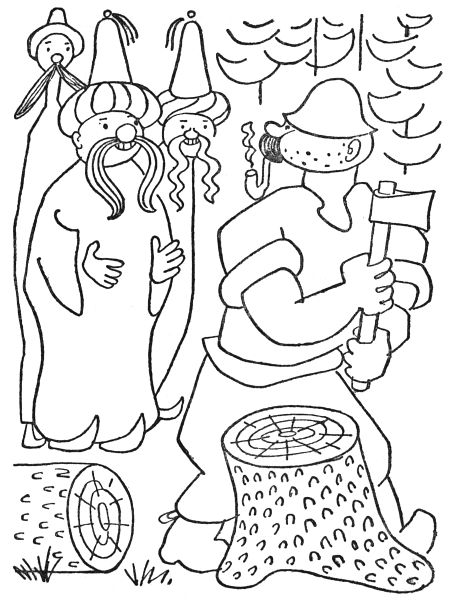

Zatímco si to pihovatý Vincek drandil do Hořiček a do Úpice a do Kostelce pro doktory, seděl hronovský doktor u kouzelníka Magiáše a dával pozor, aby se mu neudusil. Aby jim líp uběhlo čekání, zapálil si viržinku a mlčky pokuřoval.

  

Když už mu to bylo dlouhé, odkašlal a hulil dál. Potom, aby si ukrátil dlouhou chvíli, třikrát zívl a zamrkal. Po nějakém čase prohodil: „Ach jo.“ Asi za půl hodiny se protáhl v kříži a řekl: „Inu énu.“ Po nějaké hodince k tomu doložil: „Snad bychom si zatím mohli zahrát v karty. Pane Magiáš, máte tady nějaké karty?“

Kouzelník Magiáš nemohl mluvit, a tož jen zavrtěl hlavou, že ne.

„Nemáte?“ bručel hronovský doktor. „To je škoda. A to jste pěkný kouzelník, když ani nemáte karty! To u nás v hospodě dával představení jeden kouzelník, počkejte, jakpak on se jmenoval, nějak jako Navrátil nebo Don Bosko nebo Magorello, tak nějak, a ten vám dělal takové čarodějné kousky s kartami, že byste mrkal. Inu, čarovat se musí umět.“

Potom si zapálil novou viržinku a řekl: „Tak když tu nemáte karty, budu vám povídat pohádku o princezně solimánské, aby nám líp utekl čas. Kdybyste tu pohádku náhodou znal, jen řekněte a já hned přestanu. Cililink, začíná se.

Jak známo, za Kavčími horami a Sargasovým mořem jsou Dalamánské ostrovy a za nimi je poušť Šarivari porostlá hustým lesem, s hlavním cikánským městem Eldorádem; pak se široko daleko prostírá jeden poledník a jedna rovnoběžka, a tam hned za řekou, jak se jde přes tu lávku a pak tou pěšinou vlevo, za keřem vrbovým a příkopem lopuchovým se rozkládá velké a mocné Sultánství solimánské. Tak už jste jako doma, že?

V Sultánství solimánském, jak už jméno ukazuje, panoval sultán Solimán. Ten sultán měl jedinou dceru, Zubejda se jmenovala; a ta princezna Zubejda vám z ničeho nic začala marodit a postonávat a pokašlávala, chřadla a hynula a hubla a bledla, truchlila a vzdychala, že bylo žalno se na to podívat. To se rozumí, sultán k ní honem povolal své dvorní čaroděje, zaříkávače, kouzelníky, báby vědmy, mágy a astrology, mastičkáře a dryáčníky, lazebníky a felčary a kuršmídy, ale žádný z nich nemohl princeznu uzdravit. Kdyby to bylo u nás, řekl bych, že ta holka trpěla anémií, pleuritidou a bronchiálním katarem; ale v zemi solimánské není taková vzdělanost a medicína tam není tak pokročilá, aby se tam mohly vyskytovat nemoci s latinskými jmény. To si můžete myslet, jak byl starý sultán zoufalý. Můj ty Monte Kristo, říkal si, tak jsem se těšil, že holka po mně převezme kvetoucí živnost sultánskou, a zatím, chudera, mně tuhle hasne a skomírá před očima, a já jí nemohu pomoci! – A tak zavládl u dvora i v celé zemi solimánské smutek veliký.

V tu dobu tam přišel jeden obchodní cestující z Jablonce, nějaký pan Lustig, a když slyšel o té nemocné princezně, povídá: ‚Měl by k ní pan sultán zavolat doktora od nás, jako z Evropy, protože u nás je medicína pokročilejší; tady máte jenom zaříkávače, kořenáře a kouzelníky, ale u nás, holenku, jsou praví a študovaní doktoři.‘

Když se o tom dozvěděl sultán Solimán, povolal k sobě toho pana Lustiga, koupil od něho šňůru skleněných perel pro princeznu Zubejdu a pak se ho zeptal: ‚Pane Lustig, podle čeho se u vás pozná pravý a študovaný doktor?‘

‚To je docela lehké,‘ řekl pan Lustig. ‚Pozná se podle toho, že má před svým jménem dr. Například dr. Mann, dr. Pelnář a podobně. A když nemá žádné dr., tak to není študovaný doktor, víme?‘

‚Aha,‘ řekl sultán a bohatě obdaroval pana Lustiga sultánkami; víte, to jsou takové dobré hrozinky. A potom poslal do Evropy posly pro doktora. ‚Ale to si pamatujte,‘ kázal jim při loučení, ‚že pravý a vyučený doktor je jenom ten, který se začíná slabikou dr. Jiného mi sem nevoďte, nebo vám uříznu uši i s hlavou. Tak alou!‘

Kdybych měl povídat, co všecko ti vyslanci tou dlouhánskou cestou do Evropy zkusili a zažili, to by byla, pane Magiáš, moc dlouhá pohádka. Ale po mnoha a mnoha útrapách se přece jen ti poslové do Evropy dostali a začali hledat doktora pro princeznu Zubejdu.

Tak ten průvod solimánských poslů, takových hromských mameluků s turbany na hlavách a pod nosem s frňousy tlustými a dlouhými jako koňské ocasy, se dal na cestu černým lesem. Šli a šli, až potkali strejdu se sekerou a pilou na rameně.

‚Pámbu zdravíčko,‘ pozdravil je ten strejda.

‚Dej to pámbu,‘ řekli poslové. ‚Copak vy, strejčku, jste?‘

‚Ále,‘ povídá ten člověk. ‚Děkuju za optání. Já jsem jenom drvoštěp.‘

Ti pohani zastříhali ušima a pravili: ‚Vašnosti, to je jiná. Když vy ráčíte být dr.Voštěp, tak vás máme poprosit, abyste štandopede, šupito a presto šel s námi do země solimánské. Pan sultán Solimán se nechá pěkně poroučet a uctivě vás zve na svůj dvůr; ale kdybyste se zdráhal nebo se případně zpěčoval, tak vás tam dopravíme násilím, a to vám, blahorodí, říkáme, nepřejte si nás.‘

‚Ale, ale,‘ divil se ten drvoštěp, ‚a co se mnou pan sultán chce?‘

‚Má pro vás nějakou práci,‘ řekli poslové.

‚Tak to bych šel,‘ svolil drvoštěp. ‚Já totiž, páni, zrovna hledám práci. Abyste věděli, já jsem do práce jako drak.‘

Poslové na sebe mrkli a povídali: ‚To se nám, vaše slovutnosti, právě hodí.‘

‚Počkat,‘ řekl drvoštěp. ‚Nejdřív bych chtěl vědět, kolik mně pan sultán za mou práci zaplatí. Já sic nejsem drahorád, ale snad pan sultán není držgrešle.‘

Poslové sultána solimánského na to zdvořile odpověděli: ‚To nevadí, vašnosti, že neračte být dr.Ahorád, – nám je dr.Voštěp stejně vítán; ale co se týče našeho pana sultána Solimána, můžete nám věřit, že on není dr.Žgrešle, nýbrž jenom obyčejný panovník a tyran.‘

‚Tak je dobře,‘ pravil drvoštěp. ‚A co se týče stravy, tak já při práci jím jako dravec a piju jako dromedár, víme?‘

‚Učiníme vše, vzácný pane,‘ ujišťovali ti Solimánci, ‚abyste i v tom ohledu byl u nás zcela spokojen.‘

Nato dovedli s velkou slávou a úctou drvoštěpa na loď a pluli s ním až do země solimánské. Když dopluli, vylezl sultán Solimán honem na trůn a kázal je přivést k sobě. Poslové před ním poklekli a ten nejstarší a nejfousatější z nich začal:

‚Náš nejmilostivější pane a vládče, kníže všech věřících, pane sultáne Solimáne! Na tvůj vznešený rozkaz jsme se odebrali až na ostrov zvaný Evropa, abychom vyhledali toho nejučenějšího, nejvěhlasnějšího a nejslavnějšího doktora pro princeznu Zubejdu. Tak tady ho máme, pane sultáne. Je to slovutný a světoznámý lékař dr.Voštěp; abyste věděl, jaký je to doktor, tedy do práce je jako dr.Ak, je dražší než dr.Ahorád, jí jako dr.Avec a pije jako dr.Omedár. To jsou totiž, pane sultáne, samí slavní a učení doktoři, z čehož je patrno, že jsme kápli na toho pravého. Hm hm. Tak to je celkem všecko.‘

‚Vítám vás, dr.Voštěpe,‘ řekl sultán Solimán. ‚Prosím vás, abyste se šel podívat na mou dceru, princeznu Zubejdu.‘

Inu, proč bych nešel, řekl si drvoštěp; sám sultán ho vedl do takové šeré, zastíněné komnaty, vystlané těmi nejkrásnějšími koberci a polštáři a poduškami, a na nich odpočívala princezna Zubejda, bledá jako z vosku, a dřímala.

‚A jejej,‘ povídá drvoštěp soucitně, ‚pane sultán, ta vaše holka je nějaká zelinka.‘

‚To je,‘ vzdychl sultán.

‚Taková nedomrlá,‘ pravil drvoštěp. ‚Drobet jako nanicovatá, že?‘

‚Ba právě,‘ přitakal sultán smutně. ‚Nic nám nechce jíst.‘

‚Hubená jako šindel,‘ řekl drvoštěp. ‚Jako věchejtek. A žádnou barvu nemá, pane sultán. Já bych řek, že to ďouče marodí.‘

‚Baže marodí,‘ děl sultán sklíčeně. ‚Proto jsem vás povolal, abyste ji uzdravil, když jste dr.Voštěp.‘

‚Já?‘ podivil se drvoštěp. ‚Propána, jak já ji mám uzdravit?‘

‚To už je vaše věc,‘ řekl sultán Solimán temným hlasem. ‚Proto jste tady a basta fidli. Ale to vám říkám, jestli ji nevyhojíte, dám vám setnout hlavu a bude s vámi amen.‘

‚Ale to přece nejde,‘ chtěl se bránit polekaný drvoštěp, jenže pan Solimán ho ani nenechal domluvit.

‚Žádné výmluvy,‘ děl přísně, ‚na to já nemám pokdy, já musím jít vládnout. Jenom se dejte do práce a ukažte, co umíte.‘ A šel si sednout na trůn a vládl.

Zatrápená věc, řekl si drvoštěp, když osaměl, to jsem se dostal do pěkné bryndy! Jak já k tomu přijdu, abych uzdravoval nějakou princeznu? Vím já, jak se to dělá? Tohle mně je nadělení! Pro pět ran do pařezu, co si mám počít? Když tu holku nevyhojím, useknou mi hlavu. Kdyby to nebylo v pohádce, tak bych řek, že to ani nejde, pro nic za nic někomu setnout makovici! Čert mi byl dlužen, že jsem se dostal do pohádky! V obyčejnském životě by se mi něco takového stát nemohlo! Namouduši, to jsem sám zvědav, jak se z toho vyvlíknu!

V takových a ještě těžších myšlenkách si chudák drvoštěp sedl na zápraží sultánova zámku a žalostně vzdychal. Krucifagot, řekl sám k sobě, co je to napadlo, že tu mám dělat doktora? Kdyby mně poručili, poraz tenhleten nebo tamhleten strom, já bych jim ukázal, co dovedu! To bych se do toho dal, až by třísky lítaly! Však to tu, koukám, mají kolem stavení zarostlé jako v pralese, ani sluníčko jim do sednice nezasvítí; dyť se jim v baráku musí držet vlhkota a houba a plíseň a škvoři! Počkat, já jim ukážu, jakou dovedu dělat práci!

Jen si to řekl, už shodil kabát, plivl si do dlaní, popadl svou sekeru a pilu a začal kácet stromy, co rostly kolem sultánova zámku. Kdepak, to nebyly hrušně ani jabloně ani ořeší jako u nás, ale samé palmy a oleandry a kokosovníky, dracíny, latanie a fíkusy a stromy mahagonové a stromy, co rostou až do nebe, a jiná exotická zeleň. To byste koukal, pane Magiáš, jak se do toho ten náš drvoštěp pustil! Když zvonilo poledne, byla už kolem zámku notná paseka; tu si drvoštěp utřel rukávem pot, vytáhl z kapsy kus černého chleba s tvarohem, co si přinesl z domova, a dal se do jídla.

Do té doby princezna Zubejda spala ve své šeré komnatě; při tom rámusu, co dělal dole před zámkem drvoštěp se svou sekerou a pilou, se jí spalo jako nikdy dosud. Probudila se teprve tím tichem, když drvoštěp přestal kácet stromy, uvelebil se na hromadě dříví a ukusoval chleba s tvarohem.

Tu princezna otevřela oči a podivila se: jaké to je v té komnatě nebývalé světlo? Poprvé v životě vpadlo tam slunce plným proudem a naplnilo tu šerou komnatu září nebeskou. Princeznu ta záplava světla až oslnila; přitom tam oknem zavonělo čerstvě naštípané dříví tak silně a krásně, že princezna vdechla hluboce a s rozkoší. A do té smolné vůně tam zavonělo ještě něco, co princezna dosud neznala – co to je? Vstala a šla se podívat oknem: místo vlhkého stínu paseka planoucí v slunci poledním, a tam sedí veliký strejda a s náramnou chutí jí něco černého a něco bílého; a to bylo právě to, co tak dobře princezně zavonělo. To víte, vždycky nám nejlákavěji voní to, co jí někdo jiný.

Princezna to už nemohla vydržet; ta vůně ji táhla dolů, před zámek, blíž a blíž k tomu obědvajícímu strejdovi, aby se podívala, co to má dobrého k snědku.

‚Á, princezna,‘ ozval se drvoštěp plnou hubou. ‚Nechtěla byste kousek chleba s tvarohem?‘

Princezna se začervenala a zavrtěla sebou; styděla se říci, že by to strašně chtěla ochutnat.

‚Tak nate,‘ zabručel drvoštěp a ukrojil jí křivákem pořádný kus krajíce. ‚Tumáte.‘

Princezna mrkla kolem, nedívá-li se někdo. ‚Děkan,‘ vyhrkla na poděkování, zakousla se do krajíce a řekla: ‚Hm, to je dobrota!‘ Prosím vás, chleba s tvarohem, to taková princezna jakživa ani neviděla.

V tu chvíli se podíval oknem sám pan sultán Solimán. Ani nevěřil svým očím: místo vlhkého stínu světlá paseka planoucí v slunci poledním, a tam na hromadě dříví sedí princezna s plnou papulou, má od tvarohu vousy od ucha k uchu a krmí se s takovou chutí jako nikdy dosud.

‚Pámbíček zaplať,‘ oddechl si sultán Solimán, ‚tak mně k té holce přece jen přivedli toho pravého a študovaného doktora!‘

A od té doby, pane Magiáš, začala princezna doopravdy sílit, i tváře jí zčervenaly, a jedla jako vlčinka. To je oučinek světla a vzduchu a sluníčka, abyste věděl. A já vám to povídám proto, že vy tady taky žijete v takové sluji, kam slunce nesvítí a vítr nezavane; a to, pane Magiáš, není zdravé. Tak to jsem vám chtěl jako říct.“

* * *

Když hronovský doktor dopověděl pohádku o princezně solimánské, přihnal se pihovatý Vincek a vedl s sebou doktora z Hořiček, doktora z Úpice a doktora z Kostelce. „Tak tady je vedu,“ křičel už zdálky. „Lidičky, to jsem se uhnal!“

  

„Vítám vás, páni kolegové,“ pravil hronovský doktor. „Tady je náš pacient, pan černokněžník Magiáš. Jak vidíte na první pohled, jeho stav je velmi vážný. Pacient naznačuje, že spolkl švestku nebo slívu nebo pecku. Podle mého skromného názoru jeho choroba je prudká švestkitida.“

„Hm hm,“ řekl doktor z Hořiček. „Spíše bych soudil, že je to dusivá slivitida.“

„Nerad bych odporoval váženým kolegům,“ děl kostelecký doktor. „Ale řekl bych, že v tomto případě jde o hrtanovou peckitidu.“

„Pánové,“ ozval se úpický doktor, „navrhuji, abychom se shodli na rozpoznání, že u pana Magiáše se dostavila prudká švestkohrtanová peckoslivitida.“

„Tak to vám gratuluju, pane Magiáš,“ řekl doktor z Hořiček. „To je moc vzácná a těžká choroba.“

„Zajímavý případ,“ dodával doktor z Úpice.

„Pane kolego,“ ozval se kostelecký doktor, „to já jsem už míval pěknější a zajímavější medicínské případy. Slyšel jste už, jak jsem vyhojil hejkala z Krákorky? Když ne, tak vám to povím.“
