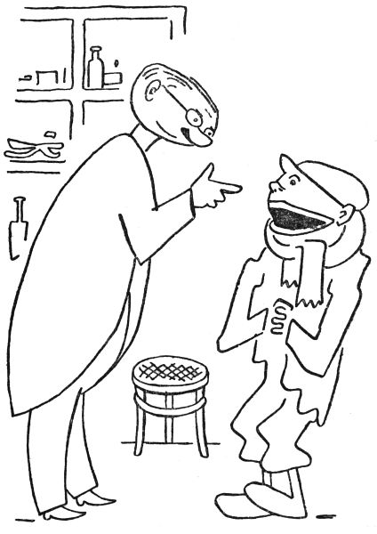

<section>

„Tomu už je taky hezkých pár let, co se v lese na Krákorce zdržoval hejkal. To víte, to je jedno z nejprotivnějších strašidel, co vůbec kdy bývaly. Jde člověk v noci lesem, a najednou to za ním zahejká, zařičí, zaúpí, zakvílí, zavyje nebo se tak hrozně zachechtá. To se rozumí, člověk se vyděsí na smrt, taková hrůza na něj padne a on běží, pádí, utíká, div duši strachem nevypustí. To teda dělá hejkal, a tuhle neplechu tropil na Krákorce léta letoucí, že už se lidé báli tam za tmy jít.

</section>

<section>

A jednou vám ke mně přijde do ordinace takový divný človíček, samá huba, papuli to má od ucha k uchu a krk ovázaný nějakým hadrem, a sípe, chrchlá, chrčí, skřehotá, chrochtá a chraptí, že mu není slova rozumět.

‚Tak co vám je?‘ povídám.

‚Pane doktore,‘ sípal ten chlapík, ‚já jsem, prosím pěkně, ňáko ochraptěl.‘

‚To vidím,‘ jářku, ‚a kterýpak vy jste?‘

Pacient se drobet ošíval a pak vyhrkl: ‚Já jsem, prosím, ten jistý hejkal z hory Krákorky.‘

‚Aha,‘ povídám, ‚tak vy jste ten kujón, ten sakrament jeden, co straší v lese lidi? A holenku, to vám patří, že jste ztratil hlas! Bodejť, já vám budu léčit vaši láry a fáryngitidu neboli hatar krtanu, chci říci katar hrtanu, abyste zase mohl po lese hejkat a nahánět lidem psotník! Nene, jen si spánembohem chraptěte a sípejte, aspoň bude od vás pokoj!‘

A tu vám ten hejkal začal s prosíkem: ‚Proboha vás prosím, pane doktore, vyhojte mě z toho chrapotu, já už budu dělat dobrotu, nebudu lidi strašit –‘

‚To vám taky neradím,‘ řekl jsem. ‚Vy jste se při tom strašení překřikl, a proto jste ztratil hlas, víme? Milá brachu, strašit v lese, to pro vás není; v lese je chladno a vlhko, a vy máte drobet choulostivé dýchací cesty. Nevím, nevím; snad by se ten váš katar dal vyhojit, ale to byste musel nadobro nechat strašení a odstěhovat se někam daleko od lesů; jináč vás neuzdraví nikdo.‘

Ten hejkal se zasmušil a drbal se za uchem: ‚To je těžká věc, milostpane, čím já se budu živit, když nechám strašení? Dyť já nic jiného neumím než hejkat a řvát, totiž dokud jsem při hlase.‘

‚Ale človíčku,‘ povídám mu, ‚s takovým vzácným hlasovým orgánem, jako máte vy, bych šel k opeře za zpěváka, za trhovníka nebo za vyvolávače k cirkusu; vždyť s tím nádherným a mohutným hlasem je vás na venkov škoda, nemyslíte? V městě byste se možná uplatnil líp.‘

‚Taky si to někdy říkám,‘ přiznal se hejkal. ‚No, já to zkusím se uchytit jinde, jen co zas budu při hlase.‘

</section>

<section>

</section>

<section>

Tak jsem mu, páni, vymazal chřtán jódem, předepsal mu chlorkali a hypermangán na kloktání a užívat anginol a na krk si dávat obklady. Od té doby toho hejkala nebylo na Krákorce slyšet; opravdu se odstěhoval a přestal strašit. Až po letech jsem se o něm doslechl znovu, a sice z velkého města Hurdyburdy. Prý se tam ten dotyčný hejkal chytil politiky a řečnil na schůzích tak silným hlasem a s takovým úspěchem, že se stal poslancem a dobře se mu do nynějška vede.

A já to tady vypravuju proto, aby pan Magiáš viděl, jak změna vzduchu dělá někdy při různých chorobách zázraky.“

</section>