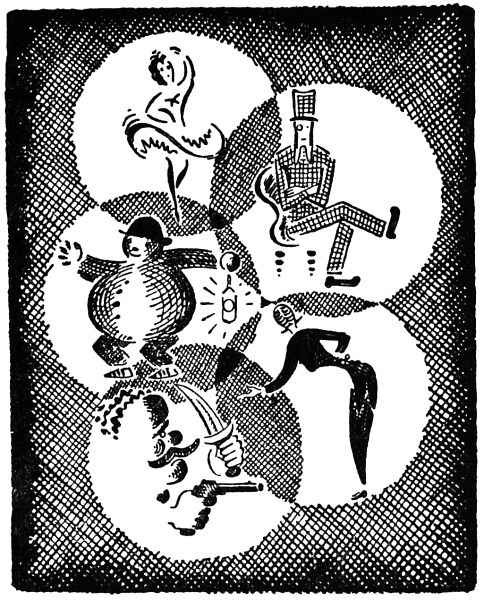

### _O tlustém pradědečkovi a loupežnících_

(od Josefa Čapka)

Můj nebožtík pradědeček byl povoláním sekerník a vedle toho obchodoval tu a tam v koních a jetelovém semínku. Při svých devadesáti osmi letech byl, chválabohu, ještě veselý a čilý brach, kulatý a červeňoučký jako jablíčko, ba, tak neobyčejně tlustý, že ho v létě prababička ukládala do sklepa, protože by se nahoře horkem rozplynul. Usadil se tedy pěkně dole ve sklepě, popíjel pivo s cukrem a těšil se na chladnější počasí.

  

Když přestalo parné léto, tu pak vylezl, batolil se po svém, hospodařil, šafařil a domostrojil, kupoval, prodával a sháněl, přibíjel, stloukal a tesařil, potil se a hmoždil se, dupal v bačkorách a klepal v pantoflích, statně jedl a pil, oháněl se zkrátka při svém valném věku a ctihodné tloušťce tak mile, že z něho všichni měli radost. Měl, panečku, nejbohatýrštější břicho z celé farnosti; však na něho také naše farnost byla hrdá. Takového druhého na farnosti nebylo: tak tlustého a červeného, tak plecitého a kolébavého, s takovými vráskami kolem očí a s takovým kulaťoučkým nosem a takovým podbradkem. Ba ani v jiných farnostech takového nebylo. Když přijel na trh do Králové Hradce, všichni se za ním ohlíželi, ať to byl student, biskup, nebo pan generál; cožpak hladový student nebo generál vyschlý a zamračený jako sleď, ale sám pan biskup nebyl daleko tak tlustý a tak ruměný, tak podsaditý a krásně kolébavý jako můj nebožtík pradědeček.

V obličeji byl pěkně vyholený, na nose, na tvářích a uších červený skoro do fialova; kolem krku si vázal strakatý šátek, přes břicho se mu klenula mocná vesta s dvěma řadami kovových knoflíků, a v ní měl velikou tabatěrku, do které se vešla libra sňupavého tabáku. Tak tu stál mezi povozníky a sedláky, mezi mlynáři a sekerníky a mluvil a vykládal, nebo seděl v hospodě, když ho bolely nohy, a tam mluvili a vykládali a šprýmovali. Ach, takových starosvětských a důkladných lidí už není! Však se také mému pradědečkovi přihodily věci zcela neobyčejné, jaké se už dnes nestávají.

Tak vám jednou prodal koně a vracel se se psem Voříškem a s několika stovkami v kapse domů, když ho na horách překvapila veliká bouře. Protože pradědeček měl raději pivo než vodu, ohlížel se honem po nějaké hospodě, kde by mohl pěkně v suchu přečkat lijavec a hromobití. Daleko široko nebylo stavení než o samotě mizerná hospoda „U oběšeného a láhve“. Jak už napovídá jméno, neměla ta hospoda zrovna dobrou pověst. Ale když daleko široko nebylo jiného úkrytu, nezbývalo pradědečkovi než uchýlit se do přístřeší „Oběšeného a láhve“, i učinil tak nerad, co lijavec máčel ho až na kůži a Voříška až na kosti, a proklínal bouři, klusaje, co mu stačil dech, k hospodě, jejíž všechna okna svítila.

Toho se však dobrý pradědeček i Voříšek ani ve snu nenadáli, že tu zapadnou rovnou do loupežnického bálu. Ano, měli tu zrovna nejhorší loupežníci bál a všichni ti chlapi se vám navlékli do nejrůznějších masek. Byl tady náčelník lupičů, proslulý Lotrando, ve fraku, v bílé kravatě a rukavicích jako veliký pán, jeho milenka, lstivá a napudrovaná Kokotička, se oblékla za baletku, pověstný vrah Hrdlořez se přestrojil do bledě modrého a růžového atlasu pá-žete, byl tu Veliký Šibal, Krvavý Jíra i Hmaták a Chramostejl i zlý Kudlich a mezinárodní lupič Dynamit a šejdíř Kujón, zkrátka všelijaká sebranka, která si vzala masky Turků, Číňanů, medvědů a bubeníků, kolovrátkářů, rytířů i kejklířů, jak už to bývá na maškarních bálech. Tu se tedy otáčeli, hodovali a bavili se jako docela slušní a poctiví lidé, ale z jízlivých očí jim nekoukalo nic kalého. A pod parukami měli vlasy ježaté, na tvářích jizvy. Krvavému Jírovi scházely na levé ruce dva prsty, ale zato ty zbývající byly plné prstenů, ruce měli neupracované, ale s velkými zlodějskými klouby a za nehty špínu, a někteří měli i špinavé uši, protože stále pomýšleli na lotroviny a pak zapomenou pořádně se umýt mýdlem a teplou vodou. Jen si tak přejedou mokrou prackou přes obličej jako kočka a myslí, že to je tím odbyté. Tak si to, kluci, pamatujte a myjte se pořádně, když vám to maminka ráno poručí.

No tak tedy pradědeček se velmi podivil, že zapadl rovnou do bálu, trochu se lekl, ale nepomyslil si hned, že by to mohli být právě loupežníci. Voříšek frkal a otřásal se a ten si, myslím, vůbec nic nemyslil. Tak teda pradědeček pozdravil: „Dobrou zábavu přeji vespolek!“, usedl stranou a poručil si syrečky a pivo. A tu jeden z loupežníků, který tu hodoval na řízkách, k nimž střídavě přikusoval okurky, zmrzlinu a krémové trubičky, povídá: „Dobré chutnání!“ a dědeček pěkně odpověděl: „Též tak, i nápodobně,“ neboť si potrpěl na slušnost. Ale to se ví, loupežníci, kteří viděli, jaká poctivá kůže jim padla do rukou, to s ním nemysleli dobře a chtěli se na jeho účet nešlechetně pobavit.

A tak začali. „Pantáto Cvalíku,“ zaštěbetala Kokotička, jako kdyby se pradědeček nejmenoval Novotný. „Pantáto, my bychom se pěkně k sobě hodili do páru! Zadám vám jednu čtverylku, skotskou, nebo ještě raději kvapík.“ Loupežníci se řehtali. Kokotička byla tenká až moc, kdepak na pradědečka kvapík! Pradědečka zamrzela taková důvěrná řeč a ten smích. Vzpomněl si na prababičku, a jak povídám, Kokotička byla tenká jako šindel. Na tohle se ta holka nemusela tolik naparovat! I řekl tedy pradědeček, nadzvedaje svou ohromnou botu s podkůvkami a cvoky: „Nevzal jsem si na to tancování lakýrky, a třeba bych vám, slečinko, mohl šlápnout na nožičku, a vy, koukám, máte nožičky jako hůlky, jako sirky, ba co dím, jako brabec.“

Kokotičce se ta odpověď zrovna nelíbila, i obrátila se zamračeně k svému Lotrandovi, krutému lupiči. Lotrando se zlověstně zatáhl za svůj přetenký knír: „Ha, víš, kam jsi se dostal, bídný selský hřbete? Upadl jsi mezi loupežníky!“ Pradědeček se leknutím až zapotil; z toho setkání nekoukalo nic dobrého. „Já jsem proslulý Lotrando,“ pokračoval náčelník, „a tamten s loutnou, to je pověstný vrah Hrdlořez, a tu ten Turek, to je obávaný Kudlich, a ten Číňan, to je Krvavý Jíra, a medvěd, to je Dynamit, a ten bubeník je Hmaták, a kolovrátkář, to je Chramostejl, a kejklíř, to je Veliký Šibal, a rytíř, to je Kujón, všichni moji krvaví páni tovaryši! A toto je naše loupežnická hymna,“ pravil Lotrando a počal zpívat:

> „Kamarádi, drazí páni,  
> loupežníci a kumpáni,  
> dobrodruzi, taškáři,  
> zlodějíčci, kapsáři,  
> podvodníci, vrazi, rváči,  
> zabijáci, lstiví hráči,  
> nám je bene, nám je hej,  
> hej,  
> ať jsi kdo jsi, k nám se dej!“

Na to zazpíval Veliký Šibal:

> „Řetězy ze zlata, hej,  
> prsten a šperk a drahý kámen.  
> Jen pozor, brachu, dej,  
> chytnou tě a je s tebou amen.“

Sbor:

> „Štěstí ti vinšujem na tu cestu,  
> však i nás povedou do arestu!“

Hrdlořez:

> „Nabitá pistole, hej,  
> ostrý nůž s čepelí třpytnou.  
> Jen, brachu, pozor dej,  
> běda ti, když tě chytnou!“

Sbor:

> „Bratříčku, bratře, dej nám vale,  
> však se zas sejdeme v kriminále!“

Krvavý Jíra:

> „O trochu krve, hej,  
> jen píchej a bij a střílej!  
> Brachu, jen pozor dej,  
> je-li ti život milej.“

Sbor:

> „Adié, páni loupežníci,  
> na shledanou pod šibenicí!“

Tak zpívali loupežníci a přiťukávali si ve sboru naplněnými sklenicemi, co pradědeček trnul, že mohou zpívat tak strašnou píseň a být přitom tak veselí. Honem přemítal, co učinit, a tu ho napadlo, že by měl také pustit nějakou hrůzu: i vykulil ukrutně oči, svraštil čelo a ošklivě se zaškaredil a pokusil se zalhat. „Však já vím,“ povídá. „Proto jsem mezi vás přišel. Též já jsem přestrojený. Oblékl jsem se za starého tlustého sekerníka, ale já jsem vlastně slavný zloděj, lupič a mnohonásobný vrah Velevrah, který sám těmato vlastníma rukama zapíchal, podřezal a zavraždil šedesát mužů, třicet žen a patnáct dětí a vyloupil jsem všechny zámky a hrady a domy a stavení a chalupy v celém širokém okolí! A toto je můj policejní pes, sveřepý Ostrozub,“ doložil pradědeček, ohlížeje se po Voříškovi.

Ale raubířská rota se jenom pustě rozchechtala. Jak by ne! Voříšek pěkně panáčkoval a pokorně prosil hodující lupiče o kostičku. A Lotrando zvedl výsměšně do výše váček s penězi, tabatěrku, ba i strakatý kapesní šátek, vše, co nic netušícímu pradědečkovi za jeho holedbavé řeči vytáhl z kapsy ohebný zlodějíček Veliký Šibal. „I hleďme,“ povídá Lotrando, „ale tohle jsou, myslím, vaše vlastní peníze, i tabatěrka a šňupák, co vám Veliký Šibal tak pěkně vyfoukl. To, holenku, musíte jít k nám do učení, chcete-li brát cizí a své podržet.“

Pradědeček se zadrbal na týle; z téhle bryndy, pomyslil si, se tak lehko nedostanu. A loupežníci se hned rozhlučeli: „Toť, musí k nám jít za učedníka!“ – Jak jsem povídal: nejprve si z něho chtěli tropit blázna a notně ho potrápit, a kdožví co s ním potom nejhoršího zamýšleli.

I spustil Kujón: „Pověz, učedníku, kdo je to, kdo má své v cizí kapse?“ I rozmýšlí se pradědeček a povídá: „To je okradený; co bylo jeho, je v kapse zlodějově.“ „Ba ne, špatně,“ zubil se Kujón, „je to zloděj. Ten přece má v cizí kapse svou ruku!“ Hádanka se pradědečkovi naprosto nelíbila: viděl, že s takovými šejdíři pranic nepořídí; kdyby byl hádal, že zloděj, vysmáli by se mu zase, že je to okradený, a nenechali by ho nikdy uhodnout.

„A teď mu, Veliký Šibale, řekni, jaké vlastnosti musí mít pravý zloděj,“ poručil Lotrando.

Veliký Šibal se rozkročil před pradědečkem a počal přednášet: „Pravý Zloděj, Zlodějík i Zlodějíček je v noci černý, v trávě zelený, ve dne průhledný; má být tenký jako drátek a ohebný jako úhoř, aby proklouzl uchem od hrnečku, klíčovou dírkou, dveřní skulinkou, zední puklinkou; dovede se schovat pod stébelkem, ani nedýchá, ani nedutá, nesmí zakýchat a zakašlat, umí lézt po zdi jako moucha a ruce i nožky má tiché jako kočička, aby dveře nevrzaly a podlaha neskřípala, pes se nerozštěkal a hospodář se neprobudil. Smí mít v těle jen libru kostí a na těle jen tři loty masa, aby do všeho vklouzl, všudy vnikl, všude se schoval, všudy se provinul a proklouzl; když je těžší nebo tlustší, tak se musí otesat a přitesat sekerou, okrájet a ořezat pořízem, ohoblovat a připilovat, odřít, oškrabat a přidrbat, ohladit a vypulírovat, vytáhnout a ohnout, změkčit, zpružit a vztužit, vytepat cepem a palicí a vyklepat kladívkem, vymočit, zvláčnět a vysušit ve vodě, pod zemí, v ohni i ve vzduchu.“

Pradědečkovi se hrůzou zježily vlasy na hlavě, a již se před něho postavil Hmaták a ptá se: „A co, učedníku, uděláš, kdyby ses vloupal do stavení a někdo se přece ve vedlejší světnici probudil a zvolal by: ‚Je tam někdo?‘ – Co uděláš?“

„Byl bych tiše, ani bych nemuknul,“ odpověděl pradědeček.

„Chyba,“ vysmál se mu Chramostejl, „odpovíš hodně hlasitě: ‚Nikdo!‘, aby se probuzený uspokojil a řekl: ‚Ach ták, já myslel, že tam někdo je.‘ – A když bude volat: ‚Loupež!‘, odpovíš: Já nic neloupu!‘ A když bude křičet: ‚Vrazi-i-í!‘, opáčíš, že dáš pozor, abys do ničeho nevrazil, a když bude volat: ‚Po-moc!‘, odpovíš mu zdvořile: ‚Děkuju za pomoc, já už si to všechno pěkně odnesu sám.‘“

„A teď,“ rozhodnul Krvavý Jíra, „ho naučíme, jak se má pravý zloděj vypravit na krádež! Nejprve si zuj boty, ale rychle! nebo tě hezky popoženeme,“ poručil a namířil na pradědečka pistoli, aby mu ukázal, že s loupežníky, kteří si chtějí zažertovat, nejsou žádné žerty. Nebohému pradědečkovi nezbývalo než poslechnout, i jal se, vzdychaje a hekaje, zouvat své zablácené holínky. Šlo to tuze ztěžka, což o to! doma mu vždy pomáhala zouvat se prababička, a když nestačila prababička, tak ještě ostatní ženské ze stavení, stará Šulitková a ještě někdy k tomu Šulitková Marie a ještě Anna a ještě třeba Růžena a někdy i Šulitka a Zelinka, a teď si musil zout boty sám! Konečně byly nešťastné boty dole a pradědeček celý udýchaný se tu objevil v červeně a zeleně pruhovaných punčoškách, které mu prababička upletla letos v zimě.

„To je proto,“ prál Kujón, „aby tě nikdo neslyšel.“

Pak vzali tabulku, na níž hostinský křídou zapisoval dluhy, a napsali na ni „Nikdo“ a pověsili ji pradědečkovi na záda.

„To je proto, aby tě nikdo neviděl,“ ušklíbl se Dynamit.

Pak nabral Hrdlořez sazí a načernil pradědečkovi celý obličej a řekl: „To je proto, aby tě nikdo nepoznal.“

Nakonec mu dali do jedné ruky rozžatou zlodějskou svítilnu, zavěšenou na zakrouceném špagátku, takže se ustavičně točila, a pod druhou mu nastrkali zlodějské nářadí, zlodějská kladívka a kleště, sekery, pilníky a dláta, vrtáky, nebozezy a paklíče, aby prý dobře viděl a měl při ruce vše, co potřebuje.

Tak si ta ničemná chasa tropila ze starého chudáka šašky, ale to nejhorší mělo teprve přijít.

„A teď ukážeš, jak by ses plížil za loupeží hezky po špičkách, pozorně, aby se světlo zlodějské svítilny netočilo a neskákalo, tichounce jako myška, jemně jako hádek a lehce jako muška, tutlaje dech a zastavuje se při každém kroku, aby ani prkénko v podlaze nevrzlo, ani zrnko neskříplo, ani stébélko nešustlo, ani hlásek nehlesl! A jestliže podlaha vrzne a zrnko skřípne, stébélko šustne a hlásek hlesne, tak tě otesáme a přisekáme sekerou, odlehčíme, ořezáme a okrájíme nožem, ohoblujeme a připilujeme hoblíkem a pilníkem, vytepeme a vyklepeme cepem, palicí a kladívkem, změkčíme, zpružíme a vztužíme, vymočíme, zvláčníme a vysušíme pod zemí, v ohni i ve vzduchu!“

Pradědečkovi proběhl po zádech mráz, když uslyšel, jak těžkou věc na něm žádají. Ale byl v jejich moci a musel poslouchat. Loupežníci se už rozestavili dokola jako v cirkuse a těšili se na podívanou.

„Alou,“ rozkřikl se Lotrando.

Pradědeček zatajil dech a pokusil se plížit se po špičkách prstů. Ale běda! byl příliš těžký a kolébavý a nemohl udržet rovnováhu. Snažil se klást své staré nohy lehce a jemně, jako kdyby to byla vajíčka, ale při každém krůčku podlaha strašlivě vrzala a v kolenou mu hlučně loupalo a on se vratce kymácel, jako kdyby šel po provaze, a když zavesloval rukama, tu všecky zlodějské pilníky, kladiva, kleště, dláta a vrtáky a paklíče ukrutně rachotily, a na čele mu vyvstával pot a on přehlasitě vzdychal – a loupežníci se chechtali, až se za břicha popadali, vezmi je čert, lotry mizerné! tak se vysmívali stáří a šedinám!

Ha! tu však je náhle zvenčí slyšet mocný hluk, dusot koní, rachocení vozů a hukot automobilů a hrčení aeroplánů. V loupežnících to prudce hrklo a hned se přestali smát. Co si tak tropili z mého pradědečka šašky, zapomněli docela dávat pozor, aby je někdo nepřekvapil. Však se také měli čeho bát, banda ničemná! A teď zrovna se ten všechen veliký hřmot zastavil u samé hospody. Loupežníci zbledli. Zatrápeně! Mohl to být nějaký generál s vojskem, nebo zemský maršálek s ozbrojeným průvodem, nebo sám nejvyšší policejní komisař s četníky, strážníky a biřici, vyslaný, aby lupičskou rotu s velikou přesilou obklíčil, zatkl, spoutal a odvedl pod šibenici.

Loupežníci se strachy zachvěli; bylo pozdě utéci, a bezradně obrátily se zraky všech k vůdci Lotrandovi. Lotrando tu stál, tahal se za svůj předlouhý knír a přemítal. Pak vztyčil ukazováček pravé ruky, zaťukal si několikrát na čelo a řekl: „Ha, už to mám! Postavte se všichni nehybně jako sochy a ani sebou nepohněte, pokud vám nic nenaznačím. Já už obstarám to ostatní!“ Loupežníci se postavili jako sochy, vsak se již z chodby blížily kroky; byl nejvyšší čas.

Dveře se otevřely a do nich vkročil – ne nějaký generál s vojskem, ani zemský maršálek, ani sám nejvyšší pan policejní komisař, ale přemocný Lord Havelock z Londýna, jenž tuto právě cestoval se svým velikým průvodem, se sluhy a lokaji, kuchtíky, s osobními lékaři a lékárníky, tělesnými detektivy, strážci a policisty.

Lord Havelock se ovšem podivil, když tu uzřel stát nehybné maškary, Číňana, baletku a Turka, medvěda, bubeníka, kejklíře, páže a kolovrátkáře. Zastavil se ve dveřích, nasadil si do oka monokl, rozhlédl se kolem a řekl: „Ah!“ To je slovo anglické a znamená po česku také ah! Nato pokračoval s anglickým klidem: „Překvapila nás na cestě bouře, i míním tu se svým průvodem přečkat do rána. A jste vy snad hostinským?“ ptal se Lord Lotranda, který se mu horlivě klaněl za stolem.

„Vaše Urozenosti,“ ukláněl se prohnaný Lotrando, „nejsem hostinským, ale jsem k vašim službám, proslulý mistr Panákáno, majitel světoznámého kočovného divadla, podivuhodného panoptika s pohyblivými loutkami. Zde jsou,“ ukázal Lotrando dokola na své strnulé loupežníky. „Patnácte let jsem na nich pracoval, pět let jsem je zdokonaloval. Každá loutka plná koleček, háčků a páček, samá elektrika, žádný švindl. Každý jinak oblečený, jinému kousku naučený, od opravdivého člověka skoro k nerozeznání.

Bouře mne tu zastavila i s mým malým divadlem na cestě k nejznamenitějším královským a vévodským dvorům, od nichž mám přečetná pochvalná uznání, řády a vyznamenání.“

„Ah,“ podivil se Lord, „co dovedou ty vaše pohyblivé loutky?“

„Vaše Urozenosti,“ hrbil se úslužně Lotrando, „mistr Panákáno nemínil zde pořádat představení. Cítím se však nekonečně poctěn vaším vznešeným zájmem, a dovolím si vám ve vší poníženosti předvést celé své divadlo.“

Lord Havelock nasadil si druhý monokl a usedl veprostřed svého průvodu. Lotrando se znova poklonil až k zemi a provolal: „Jedno zvláštní představení pro Jeho Urozenost Lorda Havelocka!“ Potáhl si fráček a se svou bílou kravatou a bílými rukavicemi přikročil nejprve ke Kokotičce, která tu stála ve svých baletčích šatech nehybně, ani brvou nemrkajíc, jako vosková panna za výkladním sklem. Lotrando dělal, jako by jí na zádech stisknul nějaký tajný knoflík, zvolal: „Baletka!“ a ejhle! Kokotička – ta chytrácká banda se hned v každé šidbě vyznala – škubla tenkou nožkou, pak pozvedla ruku, zatvářila se líbezně, učinila několik tanečních kroků a několikrát se půvabně otočila, a když dotančila zase na svoje místo, škubla opět tenkou nožkou, spustila ruku a nehybně se zastavila.

„Ah,“ řekl Lord, „je to velmi pěkné.“

Nato pokročil Lotrando ke Kudlichovi, oblečenému za Turka, dělal, jako kdyby na něm stisknul tajný knoflík, zamrkal na něho a zvolal: „Turek,“ a hle! v Turkovi to nejprve zaharašilo jako ve stroji, pak to Turkem několikrát cuknulo, Turek složil křížem ruce na prsa, třikráte se uklonil a proslovil vždy zřetelně turecký pozdrav: „Salaam alejkum.“

„Ah,“ podivil se Lord, „též to je velmi hezké.“

Pak spustil Lotrando Krvavého Jíru, který představoval Číňana. Také v Číňanovi to zaharašilo a zaškubalo, pak zvedl ruce se vztyčenými ukazováčky do výše, třikráte se uklonil a třikráte pozdravil: „Či ču há, čiri miri hó.“

„Ah,“ vyslovil se Lord. „Pěkný Číňan.“

Takto tedy předvedl Lotrando Lordovi celé své divadlo: Hrdlořeza s loutnou, který zabrnkal písničku, pak rytíř Kujón poklekl, přísahal a provolal třikráte „sláva“, kejklíř Veliký Šibal udělal kotrmelec, medvěd Dynamit mručel a točil se nemotorně dokola, bubeník Hmaták k tomu bubnoval a kolovrátkář Chramostejl točil klikou kolovrátku.

„Ah,“ řekl Lord. „Krásné pohyblivé loutky. Co za ně chcete, mistře Panákáno?“

„Vaše Urozenosti,“ odpověděl Lotrando, „dám vám je lacino, že jste to vy. Račte si určit cenu sám.“

„Dám sto tisíc,“ rozhodl se Lord. „Můj pokladník vám je zítra vyplatí. Postavím si ty loutky do ložnice.“

Tohle bylo něco pro Lotranda, když viděl, jak mu Lord sám leze do pasti! Jaká krásná příležitost pro jeho rotu, až by všechno spalo, Lorda zavraždit a učinit ohromný lup!

„Urozenosti,“ uklonil se potměšile, „jsem přešťasten, že mým loutkám dostane se veliké cti dlít ve vaší vznešené blízkosti.“

Lord Havelock velmi uspokojen se již chtěl zvednout ze židle, ale tu padl zrak na mého pradědečka, jak tu v koutě stál ve svých pruhovaných punčochách, s umazaným obličejem a s tabulkou zavěšenou na zádech. „Ach,“ podivil se Lord, „a co umí tato loutka, mistře Panákáno?“

Milý Lotrando zapomněl docela na mého pradědečka, a nyní si pro něho nemohl v rychlosti vymyslit žádnou úlohu. I zmátl se docela a počal koktat: „To je – to je – prosím – ee – to – je Nikdo. Totiž – ee – tato loutka ještě nic neumí, není – ee – není ještě hotova.“

Ale můj tlustý pradědeček nebyl dnešní a myslil si, že teď zase on sám loupežníkům pořádně zahraje. Lotrando ještě ani nedokoktal a pradědeček jal se provádět úlohu, které ho před chvílí sami loupežníci učili. Počal se přede všemi zčistajasna plížit po špičkách jako zloděj – Lotrando oněměl, Lord si s podivem nasadil třetí monokl, zvolal „ah“ a s ním zvolal „ah“ všechen jeho průvod.

Tak se pradědeček plížil zlodějsky nejprve k Hmatákovi, sáhl mu do šatů a vytahoval mu z kapes všechny jeho paklíče, vrtáky, dlátka a nebozezy a všechno zlodějské náčiní a zpíval k tomu první sloku loupežnické hymny:

> „Kamarádi, drazí páni,  
> loupežníci a kumpáni,  
> podvodníci, taškáři,  
> zlodějíčci, kapsáři,  
> nám je bene, nám je hej,  
> ať jsi kdo jsi, k nám se dej.“

„Ah,“ řekl Lord Havelock a s ním celá jeho družina. První Lordův poboční detektiv Sherlock Holmes zastříhal ušima: počínal cítit, že o něco jde.

A nyní pradědeček začal zpívat druhou sloku loupežnické hymny:

> „Řetězy ze zlata, hej,  
> prsten a šperk a drahý kámen.  
> Jen pozor, Šibale, dej,  
> chytnou tě a je s tebou amen,“

a zamířil k Velikému Šibalovi a za zpěvu mu vytahoval z kapes ukradené šperky, zlaté věci, náramky, hodinky a prsteny. Byl toho skoro celý zlatnický krám.

  

„Ah,“ zvolal Lord Havelock a s ním jeho družina. Lordův druhý poboční detektiv Stuart Webbs zastříhal ušima: počínal tušit, že o něco jde.

A pradědeček zpíval:

> „Nabitá pistole, hej,  
> ostrý nůž s čepelí třpytnou.  
> Jen, Hrdlořeze, pozor dej,  
> běda ti, když tě chytnou!“

a vytahoval Hrdlořezovi zpod šatů vražednické zbraně, nože a pistole a dýky.

  

„Ah,“ zvolal Lord Havelock a s ním jeho průvod. Třetí Lordův poboční detektiv Joe Deebs zastříhal ušima: počínal cítit, že o něco jde.

Tak probíral můj tlustý pradědeček všechny sloky písně a jednoho loupežníka po druhém a odnímal jim jejich zlodějské nářadí a nakradené věci a vražednické zbraně a všechno to kladl na zem. Lord Havelock zvolal vždy „ah“ a s ním celá jeho družina a postupně zastříhali ještě ušima poboční Lordovi detektivové Higgs, Lutz, Leblanc a Pitt.

Lotranda si pradědeček nechal až na konec. Vytáhl mu z kapsy svůj sáček s penězi, tabatěrku, ze které si hned vydatně šňupnul, a svůj strakatý šátek, do kterého zatroubil hlučně jako na lesní roh, a zpíval k tomu:

> „O trochu krve, hej,  
> jen píchej a bij a střílej!  
> Lotrando, pozor dej,  
> je-li ti život milej!“

„Ha, Lotrando!“ zvolal Lordův poboční detektiv Clifton, který nyní měl jistotu, že jde o obávaného Lotranda a jeho tovaryše. „Lotrando!“ zvolali všichni poboční Lordovi detektivové a vytáhli provazy, pouta a želízka. „Lotrando!“ zvolal Lord Havelock a nasadil si do oka čtvrtý monokl. „Lotrando!“ vzkřikla Lordova bezpečnostní stráž, hlídači a biřicové a namířili na náčelníka a jeho bandu pušky.

„To, holenkové, musíte jít ke mně do učení, chcete-li brát cizí a své podržet,“ řekl loupežníkům pradědeček.

Lotranda a loupežníky spoutali a odvedli je i s Kokotičkou a odevzdali soudu.

Můj tlustý pradědeček se obul a umyl a Lord Havelock mu děkoval, že ho uchránil od strašlivého nebezpečí. Daroval mu vedle jiných věcí také krásnou tabatěrku, naplněnou voňavým šňupavým tabákem, ze které pak pradědeček dal okusit všem sekerníkům i obchodníkům v koních a s jetelovým semínkem z celého kraje.

Pradědeček zavolal Voříška, který se zatím v koutě napásl na zbytcích loupežnických hodů, že se sotva mohl hnout. Prababička je doma uvítala velmi nepřívětivě, že zase jdou tak pozdě z hospody, ale když jí pradědeček vypravoval, co vše se přihodilo, byla tuze ráda, že to tak dobře dopadlo.
