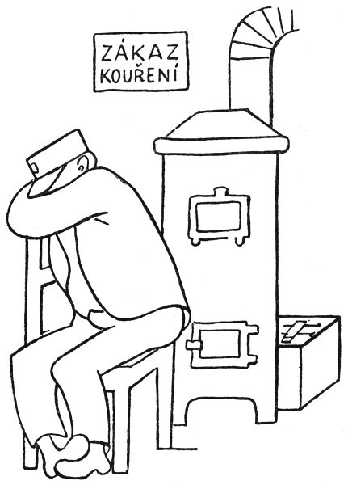
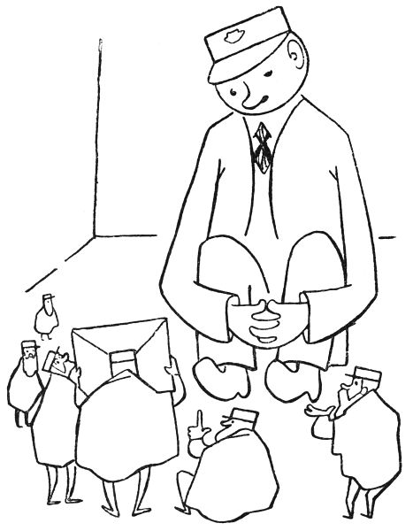
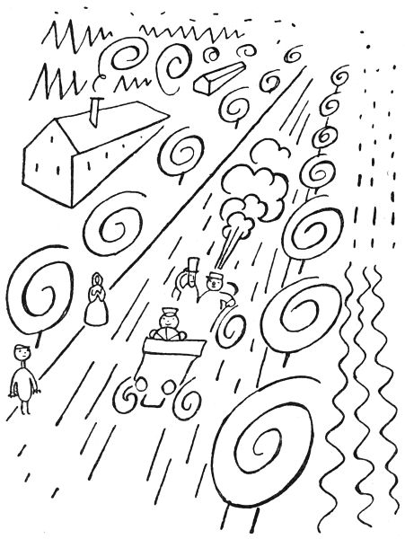
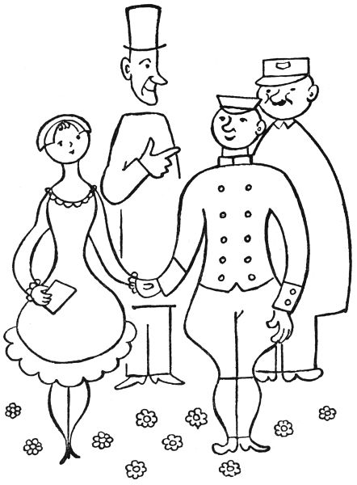

To bych rád věděl: když mohou být pohádky o všelijakých jiných lidských řemeslech a povoláních, jako o králích a princích a loupežnících, pastýřích a rytířích a černokněžnících a obrech a drvoštěpech a vodnících, proč by nemohla být také jednou pohádka o pošťákovi? Vždyť takový poštovní úřad, to je skoro jako zakleté místo; máte tam samé nápisy, že „kouřiti je zakázáno“ a „psy s sebou bráti je zakázáno“, a mnoho jiných varovných tabulek – říkám vám, tolik vyhlášek a zápovědí nemají ve svých úřadovnách ani čarodějníci, ani draci. Už z toho je vidět, že pošta je místo tajemné a mocné. A pak, děti, kdopak kdy viděl, co se děje na poště v noci, když je zavřená? Jářku, na to bychom se chtěli podívat! Však jeden pán – abyste věděli, byl to pan Kolbaba, povoláním pošťák a listonoš – se na to doopravdy podíval a řekl o tom ostatním listonošům a pošťákům a ti to zase řekli dál, až se to doneslo ke mně; a já nejsem tak nepřející, abych to nechal sám pro sebe. Tak jen s tím ven a už se začíná.

  

Tedy toho pana Kolbabu, povoláním listonoše a pošťáka, nějak omrzelo jeho pošťácké řemeslo: co prý se takový listonoš nachodí, naběhá, nadrandí, nalítá, nahoní a našlape, že prý den co den musí ujít dvacet devět tisíc sedm set třicet pět kroků, v čemž je zahrnuto osm tisíc dvě stě čtyřicet devět schodů nahoru a dolů, a že ty dopisy, co roznáší, jsou beztoho samé tiskopisy a účty a jiné zbytečnosti, které nikomu neudělají ani trochu radosti, a že i ten poštovský úřad je takové neveselé a nijaké místo, kde se ani žádné pohádky nedějí. Tak a všelijak jinak si naříkal pan Kolbaba na své pošťácké povolání. A jednou vám si ze samého smutku sedl na poště u kamen a usnul a ani si nevšiml, že už je šest hodin; a když odbila hodina šestá, odešli ostatní pošťáci a listonoši a zavřeli poštu a pan Kolbaba tam zůstal zamčený a spal.

Mohlo být k půlnoci, když ho probudil takový šramot, jako když myši ťapou po podlaze. Heleme, řekl si pan Kolbaba, máme tu myši; měla by se na ně políčit past. A když se tak kouká po těch myších, vidí, že to nejsou žádné myši, ale poštovští skřítkové. To vám jsou takoví malí a fousatí pumprlíci, asi tak velicí jako menší slepice wyandotka nebo jako veverka nebo jako lesní králík, tak asi; a na hlavách mají poštovské čepice jako praví pošťáci a nosí pelerínky jako praví listonošové. Zatrachtile, řekl si pan Kolbaba, ale jinak ani nemukl, ani necekl, ba ani nešpitl, aby je nezaplašil. A vida, jeden ten poštovský skřítek přerovnával dopisy, které měl ráno pan Kolbaba roznést; druhý třídil poštu; třetí vážil balíčky a lípal na ně cedulky; čtvrtý huboval, že tady ta škatule není ovázána podle předpisu; pátý seděl u okénka a přepočítával peníze, jako dělají poštovní úředníci. „Vždyť jsem si to myslel,“ broukal ten skřítek, „tady se ten poštovský člověk zase přepočítal o jeden halíř; musím mu to opravit.“ Šestý skřítek seděl u telegrafního aparátu a vyklepával na něm depeši, asi takhle: taktak tak tak taktaktak ták. Ale pan Kolbaba rozuměl, co telegrafuje; v obyčejné řeči to bylo: „Haló, ministerstvo pošt? Tady poštovní šotek číslo sto jedenatřicet. Hlásím všechno v pořádku stop. Kolega elf Matlafousek má kašel hlásí se marod nenastoupil službu stop. Tě péro stop.“

„Tady je dopis do města Bambolimbonandy v Království kanibálském,“ ozval se sedmý trpaslík. „Kde to je?“

„To je via Benešov,“ řekl osmý pidimužík. „Připiš tam, kolego, Království kanibálské, stanice dráhy Dolní Trebizon, poslední pošta Kočičí Hrádek. Leteckou poštou. Tak a jsme hotovi. Copak, páni, abychom si teď trochu zahráli v karty?“

„Pročpak ne,“ řekl první skřítek a odpočítal dvaatřicet dopisů. „Tak tady jsou kartičky a můžeme začít.“

Druhý skřet vzal ty dopisy a zamíchal je.

„Snímám,“ řekl první skřítek.

„Tak rozdávej,“ pravil druhý.

„Ale, ale,“ bručel třetí, „to jsem dostal špatný list!“

„Nesu,“ řekl čtvrtý a pleskl dopisem na stůl.

„To ti přebiju,“ děl pátý a položil svůj list na tamten.

„Holenku, to je na mne slabé,“ pravil šestý a přihodil svůj list.

„Oho,“ řekl sedmý, „to já mám ještě vyšší kartu.“

„A já mám trumfové eso,“ zvolal osmý a hodil svůj list na ty ostatní.

Tohle, děti, už pan Kolbaba nemohl vydržet a vyhrkl: „Neračte se, páni, vyrušovat, ale jaképak to máte karty?“

„Á, pan Kolbaba,“ řekl první skřítek. „My jsme vás, pane Kolbaba, nechtěli budit, ale když už jste se probudil, pojďte si zahrát s námi. My totiž hrajeme jenom obyčejný mariáš.“

Pan Kolbaba si to nenechal dvakrát říkat a sedl si mezi skřítky.

„Tak tady máte karty,“ pravil druhý skřet a podal mu několik dopisů, „a můžete začít.“

Pan Kolbaba se podíval na ty dopisy, co mu dali do ruky, a řekl: „Neračte mně to mít za zlé, páni pumprdlíci, ale já nemám v ruce žádné karty, já mám jenom nedoručené dopisy.“

„No právě,“ odpověděl třetí pidimužík, „to jsou naše hrací karty.“

„Hm,“ pravil pan Kolbaba, „neračte se hněvat, páni, ale karty na hraní mají mít nejnižší sedmičku, pak osmičku, potom devítku a desítku, spodka a svrška, krále a nejvyšší eso. Ale tady v těch dopisech nic takového není.“

„A to si moc pletete, pane Kolbaba,“ řekl čtvrtý mužíček. „Abyste věděl, každý ten dopis platí víc nebo míň podle toho, co je v něm uvnitř napsáno.“

„Nejnižší karta,“ vykládal první skřítek, „takzvaná sedmička neboli minelka, to jsou takové ty dopisy, ve kterých si lidé něco nalhávají a předstírají.“

„Druhá nejnižší karta je osmička,“ pokračoval druhý trpaslík, „a to jsou takové dopisy, co lidi píší jenom z musu a povinnosti.“

„Třetí nízká karta je devítka,“ děl na to třetí mrňavec, „a to jsou dopisy, co si lidé píší jenom ze zdvořilosti.“

„První vysoká karta je desítka,“ řekl čtvrtý. „To jsou takové dopisy, ve kterých si lidé píší něco zajímavého a nového.“

„Druhá vysoká karta je spodek,“ pravil pátý. „To jsou psaníčka, co si posílají, když chtějí tomu druhému udělat potěšení.“

„Třetí vysoká karta je svršek neboli kluk,“ povídal šestý. „A to jsou dopisy mezi dobrými přáteli.“

„Čtvrtá vysoká karta se jmenuje král nebo též dáma,“ dodával sedmý. „A to je takový dopis, který je napsán z lásky.“

„A ta nejvyšší karta neboli eso,“ doložil osmý stařík, „to je takové psaníčko, kterým dává člověk tomu druhému své celé srdce. To je karta, která přebije čili přetrumfne všechny ostatní. Abyste věděl, pane Kolbaba, takové psaní se najde, když píše maminka svému dítěti nebo člověk člověku, kterého má raději než sebe sama.“

„Ale,“ řekl pan Kolbaba. „Ale teď bych rád věděl, jak medle poznáte, co stojí uvnitř v těch dopisech napsáno. To bych, páni, moc nerad slyšel, že je snad otvíráte a čtete. To se nesmí, lidičky, to byste porušili listovní tajemství a já bych vás, holoto, musel udat na policii. Propánakrále, to by byl velikánský hřích, kdyby někdo otevřel dopis, který mu nepatří!“

„To my, pane Kolbaba, taky víme,“ řekl první skřítek. „Ale my, holenku, my cítíme hmatem skrze zavřenou obálku, co v tom dopise je. Ta lhostejná psaní jsou na omak studená, ale čím víc lásky je v dopise, tím je to psaníčko teplejší.“

„A když my skřítkové si zavřený dopis položíme na čelo,“ dodal druhý, „můžeme vám říci slovo za slovem, co tam stojí psáno.“

„To teda je jiná,“ pravil pan Kolbaba. „Ale když už jsme tady tak pohromadě, tak bych se vás rád na něco zeptal. Snad vás to, páni, neurazí.“

„Že jste to vy, pane Kolbaba,“ odpověděl třetí skřet, „tak se můžete zeptat, nač chcete.“

„Já bych rád věděl,“ řekl pan Kolbaba, „co vlastně skřítkové jedí.“

„To je všelijaké,“ děl čtvrtý pumprlík. „My skřítkové, co žijeme v různých ouřadech, se živíme jako švábi, tím, co vy lidé utrousíte: takhle drobeček chleba nebo ždibec houstičky – To víte, pane Kolbaba, moc toho není, co vám lidem od huby upadne.“

„Ale my skřítkové od pošty,“ řekl pátý trpaslík, „to nemáme tak zlé. My si někdy vaříme ty telegrafní pásky jako nudle a mastíme si je poštovním lepidlem; ale to musí být lepidlo z dextrinu.“

„Nebo můžeme olizovat známky,“ podotkl šestý. „To je dobré, ale moc se nám tím zalepí fousy.“

„Ale nejvíc papáme drobečky,“ vykládal sedmý maňásek. „Víte, pane Kolbaba, proto se v úředních místnostech tak málokdy zametá, aby na nás zbyly nějaké ty drobty.“

„A že jsem tak smělý,“ ptal se dále pan Kolbaba, „kdepak vy tu vlastně přespáváte?“

„To vám, pane Kolbaba, neřekneme,“ pravil osmý dědeček. „Kdyby lidé věděli, kde my skřítkové bydlíme, tak by nás odtamtud vymetli. Kdepak, to nesmíte vědět.“

Inu, když mně to neřeknete, tak si to nechte, myslel si pan Kolbaba. Však já dám pozor, kam půjdete spát. – A sedl si zase u kamen, aby dával pozor. Ale jen se tam ulebedil, už se mu začala tak nějak klížit na očičkách víčka, a než by se řeklo pět, pan Kolbaba usnul a spal jako dudek až do božího rána.

* * *

Tedy tohle, co viděl, pan pošťák Kolbaba nikomu neřekl, protože, to víte, na poště se vlastně nesmí přespávat. Jenom od té doby ho už nemrzelo roznášet dopisy lidem. Tenhle dopis, říkal si, je takový vlažňoučký, ale tady ten zrovna hřeje, jak je teplý; to asi je psaní od nějaké maminky.

  

A jednou na poště třídil dopisy, co vybral z poštovní schránky, aby je roznesl lidem. „Heleme,“ řekl najednou, „tady je dopis v zalepené obálce, ale na té obálce není ani adresa, ani známka.“

„Aha,“ pravil pan poštmistr. „To zas někdo hodil do schránky dopis bez adresy.“

Byl tam zrovna na poště jeden pán, aby poslal své mamince doporučené psaní; ten pán to slyšel a povídá: „No, to musí být ťulpas, potrhlo, cápek, pytlík, dromedár, budižkničemu a božídřevo, kdo posílá dopis a nenapíše na něj ani adresu.“

„Ba ne,“ řekl pan poštmistr, „takových dopisů, pane, se za rok najde celá hromada. To byste nevěřil, pane, jak jsou lidé roztržití. Napíší dopis, pane, a pak s ním horempádem běží na poštu a zapomenou se, pane, podívat, že ještě nenapsali adresu. Jejej, pane, to se stává častěji, než si myslíte.“

„Ale, ale,“ divil se ten pán, „a co vy s takovými dopisy bez adresy děláte?“

„Necháme je ležet na poště, pane,“ řekl poštmistr, „protože je nemůžeme, pane, doručit.“

Pan Kolbaba zatím obracel v ruce ten dopis bez adresy a bručel: „Pane poštmistr, tohle psaní je takové teplé, v tom je jistě psáno něco upřímného. Já myslím, že by se ten dopis měl přece jen doručit tomu, komu patří.“

„Když tam není napsaná adresa, tak to nejde, a basta,“ namítal pan poštmistr.

„Tak snad byste mohli ten dopis otevřít,“ radil ten cizí pán, „a podívat se, kdo jej posílá.“

„To nejde, pane,“ řekl pan poštmistr přísně, „protože to by, pane, bylo porušení listovního tajemství a to se nesmí.“ A tím byla ta věc pro něj vyřízena.

Ale když ten cizí pán odešel, obrátil se pan Kolbaba k panu poštmistrovi: „Že jsem tak smělý, pane poštmistr, ale stran toho dopisu by nám snad mohl poradit některý pan poštovský skřítek.“ A pak vypravoval, jak jednou v noci viděl úřadovat poštovské skřítky a kterak si skřítkové dovedou číst dopisy, aniž by je otevřeli.

Pan poštmistr se zamyslil a pak řekl: „Safra, to by šlo. Tak to zkuste, pane Kolbaba; když nám ten pan skřítek řekne, co v tom zavřeném dopise stojí psáno, poznáme třeba, komu to psaníčko patří.“

Tak té noci se dal pan Kolbaba zavřít na poště a čekal. Mohla být půlnoc, když slyšel takové ťapičky ťap po podlaze, jako když myši běhají; a pak zase viděl skřítky, jak třídí dopisy a váží zásilky a počítají peníze a odklepávají depeše. A když byli se vším hotovi, sesedli se na zemi a hráli s dopisy mariáš.

V tu chvíli se pan Kolbaba ozval: „Brejvečír, páni pumprdlíci.“

„Á, to je pan Kolbaba,“ řekl ten nejstarší pumprlík. „Tak pojďte si s námi zahrát v karty.“

Pan Kolbaba si to nenechal dvakrát říci a sedl si s nimi na podlahu.

„Nesu,“ řekl první skřítek a položil svou kartu na zem.

„Přebíjím,“ děl druhý.

„Dávám fleka,“ povídá třetí.

Teď přišla řada na pana Kolbabu a on položil ten zavřený dopis bez adresy na ty tři ostatní.

„Tak jste vyhrál, pane Kolbaba,“ řekl první skřet, „protože jste nesl tu nejvyšší kartu neboli srdcové eso.“

„Že jsem tak smělý,“ odpověděl pan Kolbaba, „ale víte to jistě, že to je tak vysoká karta?“

„Abych to nepoznal,“ pravil skřítek. „To přece je psaníčko, co píše mládenec dívce, kterou má víc rád než sebe sama.“

„To se mně nezdá,“ řekl naschvál pan Kolbaba.

„A just je to tak,“ odpověděl trpaslík. „Když tomu nechcete věřit, já vám to psaníčko přečtu.“ A vzal ten dopis, položil si jej na čelo, zavřel oči a takto četl:

> „Má znejmilovanější Mařenko,

> tak ti pýšu (tady je pravopisná chyba, řekl ten skřítek, správně má být měkké i) žesem dostal místo za šoféra tak esli bys chtěla mohli bychom mít veselku napyš mně esli mně máš eště ráda pyš mně brzo tvůj věrný Frantík.“

„Tak vám děkuju, pane skřítek,“ řekl pan Kolbaba, „to jsem potřeboval vědět. Mockrát vám děkuju.“

„Není zač,“ pravil mužíček. „Ale abyste věděl, je tam osm pravopisných chyb. Moc se toho ten Frantík ve škole nenaučil.“

„Jen bych se rád dověděl, která je to Mařenka nebo který Frantík,“ bručel pan Kolbaba.

„Nemůžu sloužit, pane Kolbaba,“ řekl ten mrňavý panáček. „To tam už není psáno.“ –

Ráno nato hlásil pan Kolbaba panu poštmistrovi, že ten dopis bez adresy psal nějaký šofér Frantík nějaké slečně Mařence a že si ten pan Frantík chce tu slečnu vzít za ženu.

„I prokryndapána,“ zvolal pan poštmistr, „to je náramně důležité psaní, to by ta slečna měla dostat!“

„Já bych jí to psaníčko našup donesl,“ řekl pan Kolbaba, „kdybych jenom znal, jak se ta slečna Mařenka jmenuje vlastním jménem a ve kterém městě, které ulici a kterém popisném čísle bydlí.“

„To by, pane Kolbaba, dovedl každý,“ povídal pan poštmistr. „Na to by ani nemusel být pošťák. Ale já bych moc rád viděl, aby ta slečna to psaní dostala.“

„Dobrá, pane poštmistr,“ zvolal pan Kolbaba, „tak já tu slečnu adresátku budu hledat, i kdybych rok měl běhat a prochodit celý svět.“

To řekl, přehodil si přes rameno pošťáckou tašku s tím dopisem a s krajícem chleba a vydal se do světa.

* * *

Tak pan Kolbaba chodil a chodil a všude se ptal, nežije-li v tom kraji nějaká slečna Mařenka, co čeká psaníčko od nějakého pana šoféra Frantíka. A tak prochodil celé Litoměřicko a Lounsko a rakovnický okres a Plzeňsko a Domažlicko a Písek a Budějicko a Přeloučsko a Táborsko a Čáslavsko a hejtmanství hradecké a okres jičínský a Boleslavsko; byl v Kutné Hoře, Litomyšli, Třeboni, Vodňanech, Sušici, Příbrami, Kladně a Mladé Boleslavi a ve Voticích a v Trutnově a v Sobotce a v Turnově a ve Slaném a v Pelhřimově, ba i v Dobrušce a v Úpici a v Hronově a u Sedmi Chalup, i na Krákorce byl i v Zálesí, no zkrátka všude, a všude se přeptával po té slečně Mařence. Ono těch slečen Mařenek, co v Čechách našel, bylo moc, dohromady čtyřicet devět tisíc devět set a osmdesát, ale žádná z nich nečekala psaníčko od pana šoféra Frantíka; některé z nich sice čekaly na psaníčko od nějakého pana šoféra, ale ten se nejmenoval Frantík, nýbrž Toník nebo Ladislav nebo Václav, Josef nebo Jarolím či Lojzík anebo Florián, též Jirka nebo Johan nebo Vavřinec, ba i Dominik a Vendelín a Erazim, jenom Frantík ne; a jiné ty slečny Mařenky zase čekaly na psaníčko od nějakého pana Frantíka, ale ten zase nebyl šoférem, nýbrž zámečníkem nebo šikovatelem nebo truhlářem nebo konduktérem, případně též drogistou, čalouníkem, holičem nebo krejčím, ale just ne šoférem.

A tak ten pan Kolbaba už prochodil rok a den, ale nemohl to psaní doručit té pravé slečně Mařence. Poznal moc věcí: viděl vesnice i města, pole i lesy, východ i západ slunka, návrat skřivánků a příchod jara, setbu i žně, hříbky v lese a zrající švestky, viděl v Žatci chmel a na Mělníce vinice a v Třeboni kapry a v Pardubicích perník, ale když už mu to marné hledání trvalo rok a den, sedl si sklíčen u cesty a řekl si: „Tak to už je marné, to už snad tu slečnu Mařenku ani nenajdu.“

Bylo mu skoro do breče lítostí. Litoval slečnu Mařenku, že nedostala psaní od mládence, který ji měl raději než sebe sama; litoval šoféra Frantíka, že to jeho psaní nemůže doručit; a litoval i sebe sama, že si s tím dal takovou práci a tolik se nachodil v dešti a horku a psotě a nepohodě a že to bylo nadarmo.

A jak tak seděl u cesty a litoval, viděl, že po té cestě jede nějaké auto. Jelo pomaličku, tak asi šest kilometrů za hodinu a pan Kolbaba si řekl: No, to musí být nějaká starožitná kára, že si to šine tak pomalu. Ale když to auto přijelo blíž, viděl, že to je, kristova noho, krásná osmiválcová bugatka a že za volánem sedí smutný, černě oděný šofér a ve voze smutný, černě oděný pán.

A když ten smutný pán uviděl u cesty zarmouceného pana Kolbabu, kázal zastavit a řekl: „Pote, pošťáku, já vás kousek cesty svezu.“

Pan Kolbaba byl rád, protože ho po tak dlouhém putování už bolely nohy, sedl si u toho smutného černého pána a vůz se dal pomalu a smutně v pohyb.

Když tak ujeli asi tři kilometry, ozval se pan Kolbaba: „Že jsem tak smělý, pane, ale vy asi jedete na pohřeb, že?“

„Nejedeme,“ řekl dutým hlasem ten smutný pán. „Proč myslíte, že jedeme na pohřeb?“

„No,“ řekl pan Kolbaba, „protože vy, pane, ráčíte být tak smutný.“

„Já jsem tak smutný,“ povídal hrobovým hlasem ten pán, „protože to mé auto tak pomalu a smutně jede.“

„No jo,“ řekl pan Kolbaba, „však pročpak vám taková krásná bugatka tak pomalu a smutně jede?“

„Protože ji řídí smutný šofér,“ pravil truchlivě černý pán.

„Aha,“ děl pan Kolbaba. „Račte dovolit, vašnosti, proč vlastně je ten pan šofér tak smutný?“

„Protože nedostal odpověď na psaníčko, které dal na poštu před rokem a dnem,“ odpověděl černý pán. „Víte, on psal své znejmilejší, ale ona mu neodepsala; tak on si myslí, že ho už nemá ráda.“

Když to pan Kolbaba uslyšel, vyhrkl: „Že jsem tak smělý, nejmenuje se váš pan šofér Frantík?“

„Jmenuje se pan František Svoboda,“ odpověděl smutný pán.

„A ta slečna se jmenuje Mařenka, že?“ ptal se dále pan Kolbaba.

Tu se ozval smutný šofér a řekl s žalostným vzdechem: „Slečna Marie Nováková se jmenuje ta nevěrnice, co zapomněla na mou lásku.“

„Aha,“ vykřikl pan Kolbaba radostně, „člověče drahá, tak to vy jste ten trumbera, ten bloud, to ťululum, ten pleticha, ten trumpeta, ten vrták, ten truhlík, to nemehlo, to trdlo, to pometlo, ten tulipán, ten jelimánek, ten salát a ten přetrhdílo, ten splašený, ten střelený, ten trhlý, ten seknutý a ten pytlem praštěný, ten nádiva, ten nekola, ten nekňuba, ten ňuma, ten slíva a ten bambula, ten kašpar, ten janek, ten matěj a ten popleta, co nám hodil do poštovní schránky to psaníčko bez známky a bez adresy? Jemine, to jsem rád, že mám tu čest vás poznat! Jakpak vám slečna Mařenka mohla odepsat, když dosud to vaše psaní ani nedostala?“

„Kde, kde je to mé psaní?“ zvolal pan šofér Frantík.

„No,“ řekl pan Kolbaba, „až mně povíte, kde slečna Mařenka bydlí, tak to psaní bude, abyste věděl, rovnou na cestě k ní. Můj ty tondo, už rok a den nosím ten dopis v tašce a hledám po celém světě tu pravou slečnu Mařenku! Mládenče zlatá, nyčko honem a šupito, bez odkladu a kalupem mně dejte adresu té slečny Mařenky a já půjdu a doručím jí to psaníčko.“

„Nikam, pane pošťáku, nepůjdete,“ řekl pán, „alebrž já vás tam dovezu. Tak, Frantíku, teď přidat plynu a jede se k slečně Mařence.“

Jen to dořekl, přidal pan šofér Frantík plynu, vůz sebou trhl a teď vám to, lidičky, mazal šedesáti, sedmdesáti, osmdesáti kilometry, stovkou, stodesítkou, stodvacítkou, stopadesátkou, pořád rychleji, až motor zpíval, vyl, jásal a burácel samou radostí a černý pán si musel oběma rukama držet klobouk, aby mu neulítl, a pan Kolbaba se oběma rukama držel sedadla a pan Frantík křičel: „Pane šéf, to nám to jede, co? Sto osmdesát kilometrů! Jejdane, vždyť my už ani nejedeme, my letíme na přímý záběr ve vzduchu, helejtese, pane šéf, kde jsme nechali silnici! Pane šéf, pane šéf, vždyť my jsme dostali křídla!“

A když tak nějakou chvíli letěli rychlostí sto osmdesáti sedmi kilometrů, ukázala se taková pěkná bílá vesnice – namoutě, vždyť to byl Libňatov – a pan šofér Frantík povídá: „Pane šéf, tak bysme byli na místě.“

„Tak zastavte,“ řekl černý pán a auto se sneslo na zem na kraji té vesnice. „Ale že ta bugatka dobře jede, co?“ liboval si pán. „A teď byste, pane Kolbaba, mohl té slečně Mařence doručit to psaníčko.“

„Snad půjde se mnou pan Frantík,“ mínil pan Kolbaba. „Já myslím, že by ji rád viděl.“

„Co vás nemá,“ bránil se pan Frantík, „já se jí stydím přijít na oči, protože takovou dobu ode mne nedostala žádné psaníčko. A pak,“ dodával zachmuřeně, „kdopak ví, má-li mne ještě ráda. Jen jděte, pane Kolbaba, sám. Helejte se, ona bydlí v tamtom domečku, co má okýnka tak čistá jako studánka.“

„Tak já jdu,“ řekl pan Kolbaba, zatroubil pěkně na hubu „Jede, jede poštovský panáček, jede, jede poštovský pán“ a vykročil pravou nohou k tomu domečku. A tam za tím čistým okénkem seděla bledá dívka a šila si šatičky.

„Pozdravbůh, slečno Mařenko,“ zavolal pan Kolbaba. „To si šijete svatební šatičky?“

„Ba ne,“ pravila smutně slečna Mařenka, „to já si šiju rubáš do rakvičky.“

„Ale, ale,“ řekl soucitně pan Kolbaba, „jejej, jejdanečky, jeminkote, jemináčku, jezuskote, snad to nebude tak zlé? Copak vy, slečno, marodíte?“

„Nemarodím,“ zavzdychla slečna Mařenka, „ale srdíčko mně puká žalem.“ A přitom si položila ruku na srdce.

„Propánakrále,“ zvolal pan Kolbaba, „slečno Mařenko, počkejte ještě s tím puknutím! Že jsem tak smělý, proč vlastně vás srdce bolí?“

„Protože už rok a den,“ řekla tiše slečna Marie, „už den a rok čekám na jedno psaníčko, které nepřichází.“

„Nic si z toho nedělejte,“ těšil ji pan Kolbaba. „To já zase rok a den nosím tadyhle v tašce jedno psaníčko a nemám, komu bych je odevzdal. Víte co, slečno Mařenko, já to psaníčko dám vám.“ A přitom jí podával ten dopis.

Slečna Marie zbledla ještě víc. „Pane listonoši,“ pravila tichým hlasem, „to psaní snad není pro mne, vždyť na něm není adresa!“

„Jen se podívejte dovnitř,“ kázal pan Kolbaba, „a když to nebude pro vás, tak mně to vraťte a je to.“

Slečna Marie otevřela třesoucími se prsty ten dopis, a jak jej začala číst, růžověly jí tváře.

„Tak co,“ ptal se pan Kolbaba, „vrátíte mně ten dopis, nebo ne?“

„Nevrátím,“ vydechla slečna Marie a oči se jí zalily slzami radosti. „Pane pošťáku, vždyť to je to psaníčko, na které jsem čekala rok a den! Pane listonoši, já ani nevím, co bych vám za to dala!“

„Tak já vám to řeknu,“ pravil pan Kolbaba. „Dáte mně dvě koruny pokuty za to, že to psaní nebylo náležitě frankováno, rozumíte? Propánajána, vždyť jen proto s tím psaníčkem běhám rok a den, aby pošta dostala ty dvě korunky porta! Tak děkuju pěkně,“ řekl, když dostal ty dvě koruny, „a na vaši odpověď, slečno, tadyhle někdo čeká.“ A přitom zakýval na pana šoféra Frantíka, který už stál za rohem.

A zatímco pan Frantík dostával tu odpověď, sedl si pan Kolbaba s tím černým pánem a povídal mu: „Rok a den, vašnosti, jsem s tím psaníčkem běhal, ale stálo to za to: už proto, co všechno jsem viděl. To vám je taková pěkná a krásná země, ať je to u Plzně, nebo u Hořic, nebo u Tábora – A hele, pan Frantík se už vrací. Ona se halt ústně taková záležitost dá vyřídit rychleji nežli dopisem bez adresy.“

Pan Frantík neříkal nic, jenom mu svítily oči. „Tak jede se, pane šéf?“ ptal se.

„Jede se,“ řekl ten pán. „Nejdříve dovezeme pana Kolbabu na poštu.“

Pan šofér skočil do vozu, zmáčkl startér a přišlápl spojku a plyn a vůz se rozjel tak hladce a lehce jako ve snu. Hned vám ručička na tachometru ukazovala sto dvacet kilometrů.

„Ale že ten vůz krásně jede,“ liboval si černý pán. „To si to tak hasí proto, že jej řídí šťastný šofér.“

A všichni šťastně dojeli a my také.

_Lidové noviny 4. 10. 1931_
