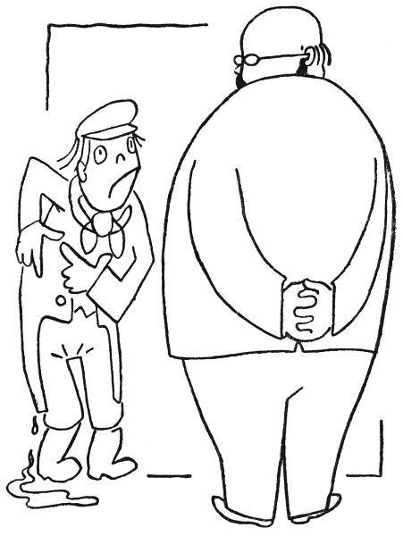

<section>

„To já jsem měl taky zajímavý lékařský případ,“ ozval se úpický doktor. „U nás v Úpě za havlovickou lávkou, v kořání vrb a olší žil starý vodník, Joudal se jmenoval; byl to takový mrzout, neruda, kakabus a bručoun, někdy dělal povodně a občas i topil děti, když se koupaly; zkrátka lidé ho v té řece neradi viděli.

</section>

<section>

Jednou na podzim ke mně do ordinace přijde děda, fráček má zelený a na krku červený šátek, a heká, kašle, kýchá, frká, vzdychá, potahuje a huhlá: ‚Pane dochtor, já jsem chyt ňákou náchladu nebo nádchu; mně tuhle pšká a tadyhle píchá, v kříži mě bolí, v kloubech mně loupe, kašel mám, div se nestrhám, a rýmu jako trám; tak bych prosil o nějaké užívání.‘

Já ho vyšetřím a povídám: ‚Dědečku, to je revma; já vám dám tadyhle to mazání, je to linimentum, abyste věděl, ale to ještě není všecko. Vy se musíte držet hodně v teple a v suchu, rozumíte?‘

‚Rozumím,‘ bručel stařík. ‚Ale s tím suchem a teplem to, mladý pane, asi nepude.‘

‚Proč by to nešlo?‘ ptám se ho.

‚Inu,‘ povídá děda, ‚protože já jsem havlovický vodník, pane dochtor. Jakpak si mám udělat ve vodě sucho a teplo? Dyť já si i nos musím utírat hladinou vodní, ve vodě spím a vodou se přikrejvám; až teď k stáru jsem si dal do postele měkkou vodu místo tvrdé, aby se mi měkčeji leželo. Ale s tím suchem a teplem, to bude těžká věc, že jo.‘

‚Nic naplat, dědečku,‘ povídám, ‚v té studené vodě se vám to revma jen pohorší. To víte, staré kosti chtějí teplo. Jak vy jste vlastně stár, pane hastrmane?‘

‚A jéj,‘ brumlal vodník, ‚pane dochtor, já jsem tady ještě z pohanských dob – to bude ňákých tisíc let a možná ještě víc. Jo, to jsou léta!‘

‚Tak vidíte,‘ řekl jsem mu, ‚v tom věku, dědo, se musíte držet u kamen. Počkat, já mám nápad! Slyšel jste někdy o horkých pramenech?‘

</section>

<section>

</section>

<section>

‚Slyšel, to jsem slyšel,‘ brblal starý vodník. ‚Ale tady žádné nejsou.‘

‚Tady ne,‘ povídám, ‚ale jsou v Teplicích a v Píšťanech a ledaskde jinde, jenže jsou hluboko pod zemí. A ty horké prameny, abyste věděl, jsou stvořeny právě pro staré a revmatické vodníky. Vy se jednoduše v takovém horkém zřídle usadíte jakožto hastrman horkovodní a budete si přitom kurýrovat revma.‘

‚Hm hm,‘ rozpakoval se dědek, ‚a co vlastně takový horkovodní hastrman má na práci?‘

‚Moc ne,‘ jářku, ‚jen musí pořád z nitra země táhnout tu horkou vodu nahoru, aby nevychladla. A přebytek té teplé vody pouští na povrch země. To je všecko.‘

‚To by šlo,‘ bručel havlovický vodník. ‚Tak to já se po nějakém takovém horkém prameni poohlídnu. Mockrát děkuju, pane dochtor.‘ A belhal se z ordinace – jen loužička na podlaze po něm zbyla.

A vidíte, pane kolego, havlovický hastrman měl ten rozum a poslechl; usadil se na Slovensku v horkém zřídle a vytahuje z hlubin země tolik vroucí vody, že na tom místě je teď věčný teplý pramínek. A v tom horkém zdroji se koupají lidé a taky jim to dělá dobře na revma; z celého světa se tam jezdí kurýrovat. Vemte si z toho příklad, pane Magiáš, a poslechněte ve všem, co vám my doktoři poradíme.“

</section>
